# Ralph Skill 企业级自治编程引擎设计文档

## 概述

Ralph Skill 是一个企业级的自治编程引擎，旨在将基础的 Ralph 自治循环脚本升级为多智能体协作引擎。该系统采用模块化架构设计，提供 Git 级别的安全回滚机制、上下文截断与防爆机制、高级状态机与依赖管理等核心功能。

系统使用 Python 重写以增强可维护性，支持多种 AI 引擎（Qwen Code、Aider 等），并提供标准化的 OpenClaw 接口供上层 Master Agent 调用。

### 核心特性

- **安全性**: Git 级别的版本控制和回滚机制，安全沙箱环境
- **可靠性**: 上下文防爆机制，智能错误处理和恢复
- **扩展性**: 多 AI 引擎兼容，插件化钩子系统
- **易用性**: 标准化接口，配置文件驱动
- **全栈支持**: Vue3/Vitest/Playwright 前端，Go/Make 后端

## 架构

### 系统架构图

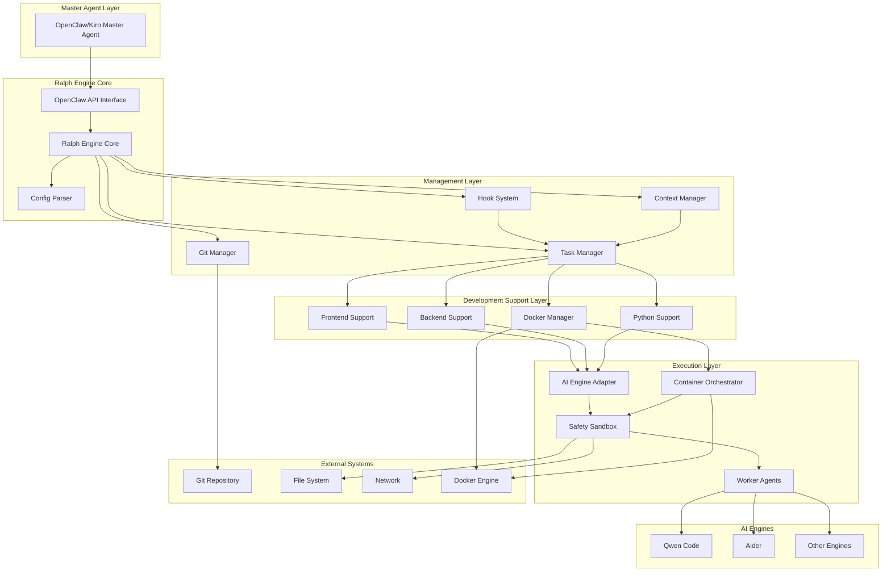

### ACP Harness 集成架构

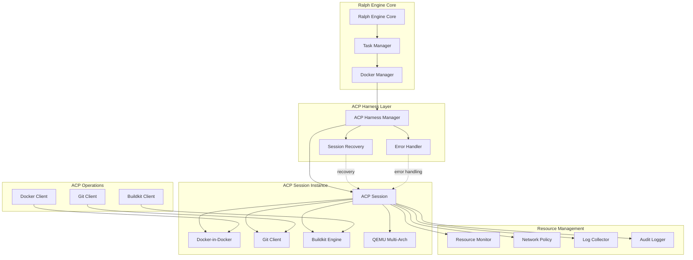

### ACP 会话工作流程

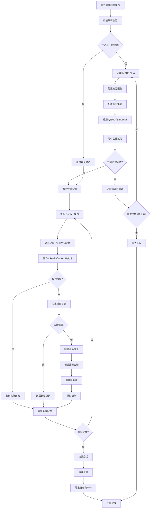

### 分层架构

系统采用分层架构设计，从上到下分为：

1. **接口层 (Interface Layer)**: 提供标准化的 OpenClaw API 接口
2. **核心层 (Core Layer)**: Ralph Engine 核心逻辑和配置管理
3. **管理层 (Management Layer)**: 任务、版本、上下文和钩子管理
4. **执行层 (Execution Layer)**: AI 引擎适配和安全沙箱执行
5. **引擎层 (Engine Layer)**: 具体的 AI 引擎实现

## 组件和接口

### 核心组件

#### 1. Ralph Engine Core

**职责**: 系统核心协调器，负责组件间的协调和整体流程控制。

**主要接口**:
```python
class RalphEngineCore:
    def execute_task(self, task_config: TaskConfig) -> TaskResult
    def get_task_status(self, task_id: str) -> TaskStatus
    def cancel_task(self, task_id: str) -> bool
    def list_active_tasks(self) -> List[TaskInfo]
```

#### 2. Task Manager

**职责**: 任务生命周期管理，状态机控制，依赖关系处理。

**状态机**:
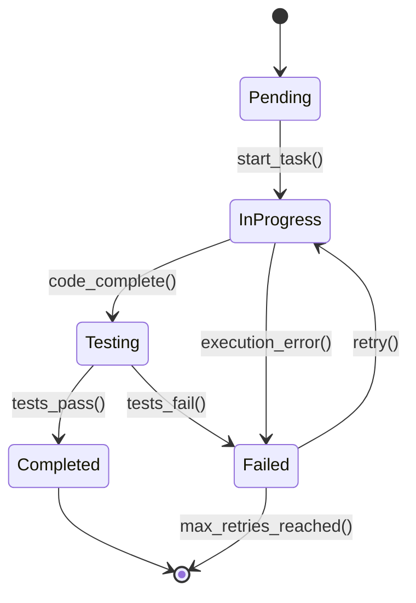

**主要接口**:
```python
class TaskManager:
    def create_task(self, config: TaskConfig) -> Task
    def start_task(self, task_id: str) -> bool
    def update_task_status(self, task_id: str, status: TaskStatus) -> None
    def resolve_dependencies(self, tasks: List[Task]) -> List[Task]
    def get_task_graph(self) -> TaskGraph
```

#### 3. Git Manager

**职责**: Git 版本控制，分支管理，安全回滚。

**工作流程**:
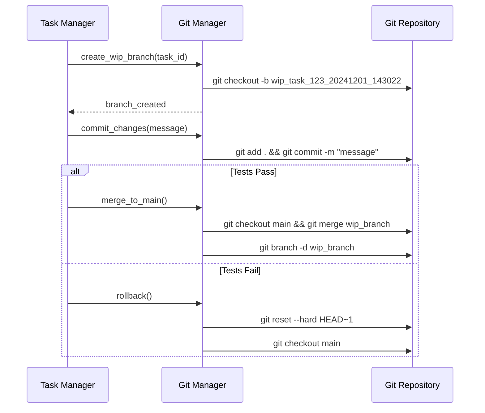

**主要接口**:
```python
class GitManager:
    def create_wip_branch(self, task_id: str) -> str
    def commit_changes(self, message: str) -> bool
    def merge_to_main(self, branch_name: str) -> bool
    def rollback(self, branch_name: str) -> bool
    def get_branch_status(self, branch_name: str) -> BranchStatus
```

#### 4. Context Manager

**职责**: 上下文大小控制，日志截断，错误信息提取。

**截断策略**:
- 保留前 2000 字符（包含初始上下文）
- 保留后 2000 字符（包含最新错误）
- 中间部分用 `[... 截断了 X 字符 ...]` 标记
- 优先保留编译错误、运行时错误、测试失败信息

**主要接口**:
```python
class ContextManager:
    def truncate_output(self, output: str, max_size: int = 10000) -> str
    def extract_errors(self, output: str) -> List[ErrorInfo]
    def manage_context_size(self, context: str) -> str
    def get_context_stats(self) -> ContextStats
```

#### 5. Hook System

**职责**: 前置和后置钩子执行，代码格式化，环境清理。

**钩子类型**:
- `pre-task`: 任务开始前执行
- `pre-test`: 测试前执行（代码格式化）
- `post-test`: 测试后执行（清理临时文件）
- `post-task`: 任务完成后执行

**主要接口**:
```python
class HookSystem:
    def register_hook(self, hook_type: HookType, hook_func: Callable) -> None
    def execute_hooks(self, hook_type: HookType, context: HookContext) -> HookResult
    def configure_hook_timeout(self, hook_type: HookType, timeout: int) -> None
```

#### 6. AI Engine Adapter

**职责**: 多 AI 引擎适配，统一接口封装，引擎切换。

**适配器模式**:
```python
class AIEngineAdapter:
    def __init__(self, engine_type: EngineType):
        self.engine = self._create_engine(engine_type)
    
    def generate_code(self, prompt: str, context: str) -> CodeResult
    def refactor_code(self, code: str, requirements: str) -> CodeResult
    def fix_errors(self, code: str, errors: List[str]) -> CodeResult
    def switch_engine(self, engine_type: EngineType) -> bool
```

**支持的引擎**:
- **Qwen Code**: 代码生成和修改
- **Aider**: 代码重构和优化
- **Claude**: 通用代码任务
- **GPT-4**: 复杂逻辑实现

#### 7. Safety Sandbox

**职责**: 安全代码执行，资源限制，权限控制。

**安全策略**:
- 文件系统访问限制在项目目录内
- 网络访问白名单控制
- 系统调用过滤
- 资源使用限制（CPU、内存、时间）
- 危险操作检测和阻止

**主要接口**:
```python
class SafetySandbox:
    def execute_code(self, code: str, language: str) -> ExecutionResult
    def run_tests(self, test_command: str) -> TestResult
    def check_security(self, code: str) -> SecurityReport
    def set_resource_limits(self, limits: ResourceLimits) -> None
```

#### 8. Config Parser

**职责**: 配置文件解析，验证，热重载。

**配置文件格式 (prd.json)**:
```json
{
  "project": {
    "name": "example-project",
    "type": "fullstack",
    "frontend": {
      "framework": "vue3",
      "test_runner": "vitest",
      "e2e_runner": "playwright",
      "build_tool": "vite"
    },
    "backend": {
      "language": "go",
      "build_system": "make"
    }
  },
  "tasks": [
    {
      "id": "task_1",
      "name": "实现用户认证",
      "type": "feature",
      "depends_on": [],
      "ai_engine": "qwen_code",
      "hooks": {
        "pre-test": ["gofmt", "eslint --fix"],
        "post-test": ["rm -rf tmp/"]
      }
    }
  ],
  "settings": {
    "max_context_size": 10000,
    "git_auto_commit": true,
    "sandbox_timeout": 300
  }
}
```

**主要接口**:
```python
class ConfigParser:
    def parse_config(self, config_path: str) -> Configuration
    def validate_config(self, config: Configuration) -> ValidationResult
    def reload_config(self) -> bool
    def pretty_print(self, config: Configuration) -> str
```

#### 9. Python Development Support

**职责**: Python 项目开发流程管理，项目类型识别，虚拟环境管理，pytest 测试集成，代码格式化。

**支持的 Python 技术栈**:
- **框架**: Django、Flask、FastAPI
- **依赖管理**: pip、poetry、pipenv
- **测试框架**: pytest、unittest
- **代码格式化**: black、isort、autopep8、ruff
- **虚拟环境**: venv、virtualenv、conda

**Python 项目识别架构**:
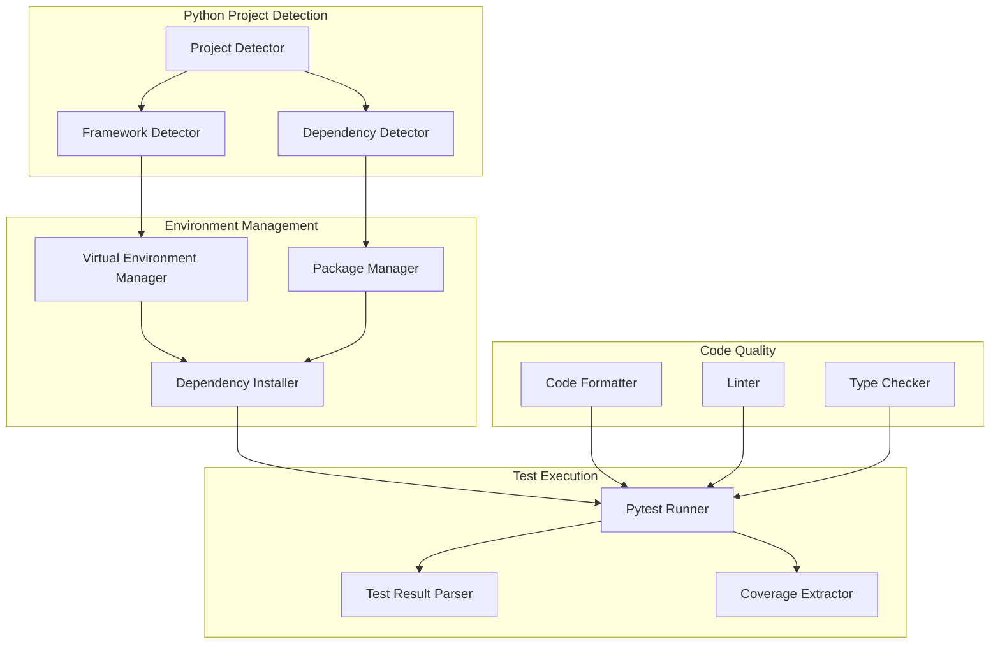

**主要接口**:
```python
class PythonSupport:
    def detect_project_type(self, project_path: str) -> PythonProjectInfo
    def detect_dependency_manager(self, project_path: str) -> DependencyManager
    def create_virtual_env(self, env_type: str, path: str) -> VirtualEnv
    def activate_virtual_env(self, env_path: str) -> bool
    def install_dependencies(self, requirements: str) -> InstallResult
    def run_pytest(self, test_path: str, config: PytestConfig) -> TestResult
    def format_code(self, file_path: str, formatter: str) -> FormatResult
    
class PytestManager:
    def setup_pytest(self, config: PytestConfig) -> bool
    def run_test_suite(self, test_files: List[str]) -> PytestResult
    def parse_test_results(self, output: str) -> ParsedResults
    def extract_coverage(self, coverage_file: str) -> CoverageReport
    def generate_html_report(self, results: PytestResult) -> str
    
class PythonEnvironmentManager:
    def detect_python_version(self, project_path: str) -> str
    def create_venv(self, path: str) -> VirtualEnv
    def create_virtualenv(self, path: str) -> VirtualEnv
    def activate_env(self, env_path: str) -> ActivationScript
    def deactivate_env(self) -> bool
    def list_installed_packages(self, env_path: str) -> List[Package]
```

**Python 项目配置**:
```python
@dataclass
class PythonProjectConfig:
    framework: str  # django, flask, fastapi, none
    dependency_manager: str  # pip, poetry, pipenv
    python_version: str  # 3.8, 3.9, 3.10, 3.11, 3.12
    test_framework: str  # pytest, unittest
    formatters: List[str]  # black, isort, autopep8, ruff
    linters: List[str]  # pylint, flake8, ruff
    type_checker: Optional[str]  # mypy, pyright
    virtual_env_type: str  # venv, virtualenv, conda
    
@dataclass
class PytestConfig:
    test_dir: str = "tests"
    coverage: bool = True
    coverage_threshold: float = 80.0
    markers: List[str] = field(default_factory=list)
    plugins: List[str] = field(default_factory=list)
    parallel: bool = False
    num_workers: int = 4
    verbose: bool = True
    capture_output: str = "no"  # no, sys, fd
    timeout: int = 300
```

**Pytest 测试结果模型**:
```python
@dataclass
class PytestResult:
    success: bool
    total_tests: int
    passed_tests: int
    failed_tests: int
    skipped_tests: int
    execution_time: float
    coverage: Optional[CoverageReport]
    failed_test_details: List[FailedPytestCase]
    warnings: List[str]
    
@dataclass
class FailedPytestCase:
    test_name: str
    test_file: str
    line_number: int
    error_type: str  # AssertionError, TypeError, etc.
    error_message: str
    stack_trace: str
    assertion_details: Optional[AssertionInfo]
    
@dataclass
class AssertionInfo:
    expected: str
    actual: str
    comparison_operator: str  # ==, !=, >, <, in, etc.
    
@dataclass
class CoverageReport:
    total_coverage: float
    line_coverage: float
    branch_coverage: float
    file_coverage: Dict[str, FileCoverage]
    missing_lines: Dict[str, List[int]]
    
@dataclass
class FileCoverage:
    file_path: str
    coverage_percent: float
    lines_covered: int
    lines_total: int
    missing_lines: List[int]
```

**Python 错误解析器**:
```python
class PythonErrorParser:
    def parse_pytest_output(self, output: str) -> List[PytestError]
    def parse_syntax_errors(self, output: str) -> List[SyntaxError]
    def parse_import_errors(self, output: str) -> List[ImportError]
    def parse_assertion_errors(self, output: str) -> List[AssertionError]
    def extract_stack_trace(self, error: str) -> StackTrace
    def categorize_error(self, error: str) -> ErrorCategory
    def suggest_fix(self, error: PytestError) -> List[FixSuggestion]
```

**代码格式化管理**:
```python
class PythonFormatter:
    def format_with_black(self, file_path: str, config: BlackConfig) -> FormatResult
    def sort_imports_with_isort(self, file_path: str, config: IsortConfig) -> FormatResult
    def format_with_autopep8(self, file_path: str, config: Autopep8Config) -> FormatResult
    def format_with_ruff(self, file_path: str, config: RuffConfig) -> FormatResult
    def check_formatting(self, file_path: str) -> bool
    def get_formatting_diff(self, file_path: str) -> str
```

#### 10. Docker Container Management

**职责**: Docker 容器化管理，镜像构建，容器编排，测试环境隔离，资源管理。

**支持的 Docker 功能**:
- **镜像管理**: 构建、标签、推送、拉取、删除
- **容器管理**: 创建、启动、停止、删除、日志收集
- **网络管理**: 网络创建、端口映射、服务发现
- **卷管理**: 数据持久化、卷挂载
- **编排**: Docker Compose 多服务编排
- **健康检查**: 容器健康状态监控
- **资源限制**: CPU、内存、磁盘限制

**Docker 管理架构**:
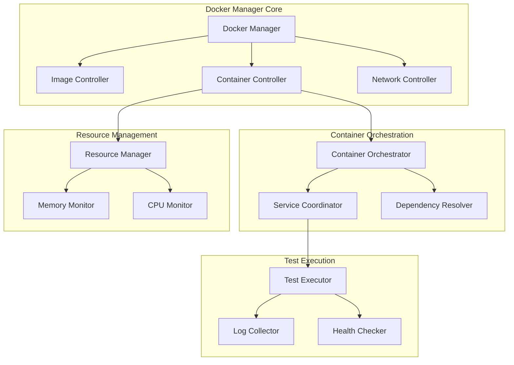

**主要接口**:
```python
class DockerManager:
    def detect_docker_config(self, project_path: str) -> DockerConfig
    def build_image(self, dockerfile_path: str, tag: str, build_args: Dict) -> BuildResult
    def create_container(self, image: str, config: ContainerConfig) -> Container
    def start_container(self, container_id: str) -> bool
    def stop_container(self, container_id: str, timeout: int = 10) -> bool
    def remove_container(self, container_id: str, force: bool = False) -> bool
    def get_container_logs(self, container_id: str, tail: int = 100) -> str
    def inspect_container(self, container_id: str) -> ContainerInfo
    def execute_command(self, container_id: str, command: str) -> ExecResult
    
class ContainerOrchestrator:
    def parse_compose_file(self, compose_path: str) -> ComposeConfig
    def resolve_service_dependencies(self, services: List[Service]) -> List[Service]
    def start_services(self, services: List[Service], parallel: bool = True) -> OrchestrateResult
    def stop_services(self, services: List[Service]) -> bool
    def scale_service(self, service_name: str, replicas: int) -> bool
    def get_service_status(self, service_name: str) -> ServiceStatus
    
class DockerTestRunner:
    def run_tests_in_container(self, container: Container, test_command: str) -> TestResult
    def collect_test_artifacts(self, container: Container, artifact_paths: List[str]) -> List[Artifact]
    def cleanup_test_containers(self, container_ids: List[str]) -> bool
    
class DockerHealthChecker:
    def check_container_health(self, container_id: str) -> HealthStatus
    def wait_for_healthy(self, container_id: str, timeout: int = 60) -> bool
    def check_service_ready(self, service_name: str, port: int) -> bool
```

**Docker 配置模型**:
```python
@dataclass
class DockerConfig:
    has_dockerfile: bool
    has_compose: bool
    dockerfile_path: Optional[str]
    compose_path: Optional[str]
    base_image: Optional[str]
    exposed_ports: List[int]
    volumes: List[VolumeMount]
    environment: Dict[str, str]
    
@dataclass
class ContainerConfig:
    image: str
    name: str
    command: Optional[str]
    environment: Dict[str, str]
    ports: Dict[int, int]  # host_port: container_port
    volumes: List[VolumeMount]
    network: Optional[str]
    resource_limits: ResourceLimits
    health_check: Optional[HealthCheck]
    restart_policy: str = "no"  # no, always, on-failure, unless-stopped
    
@dataclass
class ResourceLimits:
    cpu_limit: Optional[float]  # CPU cores
    memory_limit: Optional[str]  # e.g., "512m", "2g"
    memory_reservation: Optional[str]
    pids_limit: Optional[int]
    
@dataclass
class HealthCheck:
    test: str  # command to run
    interval: int = 30  # seconds
    timeout: int = 10
    retries: int = 3
    start_period: int = 0
    
@dataclass
class VolumeMount:
    host_path: str
    container_path: str
    mode: str = "rw"  # rw, ro
```

**Docker Compose 模型**:
```python
@dataclass
class ComposeConfig:
    version: str
    services: Dict[str, Service]
    networks: Dict[str, Network]
    volumes: Dict[str, Volume]
    
@dataclass
class Service:
    name: str
    image: Optional[str]
    build: Optional[BuildConfig]
    command: Optional[str]
    environment: Dict[str, str]
    ports: List[str]
    volumes: List[str]
    depends_on: List[str]
    networks: List[str]
    health_check: Optional[HealthCheck]
    restart: str = "no"
    
@dataclass
class BuildConfig:
    context: str
    dockerfile: str
    args: Dict[str, str]
    target: Optional[str]
```

**Docker 构建和测试结果**:
```python
@dataclass
class BuildResult:
    success: bool
    image_id: str
    image_tag: str
    build_time: float
    build_logs: str
    layers: List[LayerInfo]
    size_bytes: int
    errors: List[BuildError]
    
@dataclass
class BuildError:
    step_number: int
    command: str
    error_message: str
    error_type: str  # syntax, file_not_found, network, etc.
    
@dataclass
class ContainerTestResult:
    success: bool
    container_id: str
    exit_code: int
    stdout: str
    stderr: str
    execution_time: float
    resource_usage: ResourceUsage
    artifacts: List[Artifact]
    
@dataclass
class ResourceUsage:
    cpu_percent: float
    memory_usage_mb: float
    memory_limit_mb: float
    network_rx_bytes: int
    network_tx_bytes: int
    block_io_read_bytes: int
    block_io_write_bytes: int
```

**Docker 错误解析器**:
```python
class DockerErrorParser:
    def parse_build_errors(self, output: str) -> List[BuildError]
    def parse_container_errors(self, logs: str) -> List[ContainerError]
    def parse_network_errors(self, output: str) -> List[NetworkError]
    def identify_failed_step(self, build_output: str) -> int
    def extract_error_context(self, error: str) -> ErrorContext
    def suggest_fix(self, error: DockerError) -> List[FixSuggestion]
```

**容器化测试流程**:
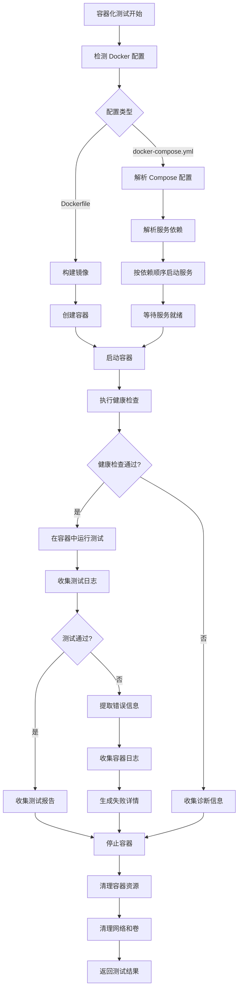

#### 11. Database Management

**职责**: 数据库连接管理，PostgreSQL 和 Redis 客户端，数据库迁移执行，测试数据库管理。

**支持的数据库技术**:
- **PostgreSQL**: 关系型数据库连接、查询执行、事务管理
- **Redis**: 缓存服务连接、基本操作（GET、SET、DEL、EXPIRE）
- **迁移工具**: Alembic (Python)、golang-migrate (Go)
- **容器化**: Docker Compose 数据库服务编排

**数据库管理架构**:
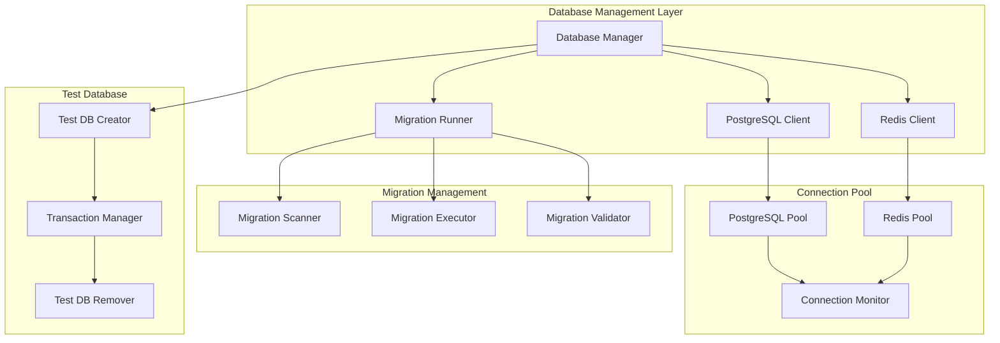

**主要接口**:
```python
class DatabaseManager:
    def connect_postgresql(self, config: PostgreSQLConfig) -> PostgreSQLClient
    def connect_redis(self, config: RedisConfig) -> RedisClient
    def verify_connection(self, client: DatabaseClient) -> ConnectionStatus
    def create_test_database(self, template_db: str) -> TestDatabase
    def cleanup_test_database(self, test_db: TestDatabase) -> bool
    def execute_migrations(self, migration_dir: str, target_version: Optional[str] = None) -> MigrationResult
    def rollback_migration(self, steps: int = 1) -> MigrationResult
    
class PostgreSQLClient:
    def execute_query(self, sql: str, params: Optional[Dict] = None) -> QueryResult
    def execute_many(self, sql: str, params_list: List[Dict]) -> QueryResult
    def begin_transaction(self) -> Transaction
    def commit_transaction(self, transaction: Transaction) -> bool
    def rollback_transaction(self, transaction: Transaction) -> bool
    def get_connection_info(self) -> ConnectionInfo
    def close(self) -> None
    
class RedisClient:
    def get(self, key: str) -> Optional[str]
    def set(self, key: str, value: str, expire: Optional[int] = None) -> bool
    def delete(self, key: str) -> bool
    def expire(self, key: str, seconds: int) -> bool
    def exists(self, key: str) -> bool
    def ping(self) -> bool
    def get_connection_info(self) -> ConnectionInfo
    def close(self) -> None
    
class MigrationRunner:
    def detect_migration_tool(self, project_path: str) -> MigrationTool
    def scan_migrations(self, migration_dir: str) -> List[Migration]
    def get_current_version(self) -> str
    def execute_migration(self, migration: Migration) -> MigrationResult
    def parse_migration_error(self, error_output: str) -> MigrationError
```

**数据库配置模型**:
```python
@dataclass
class PostgreSQLConfig:
    host: str
    port: int = 5432
    database: str
    user: str
    password: str
    ssl_mode: str = "prefer"  # disable, allow, prefer, require
    connection_timeout: int = 30
    pool_size: int = 10
    max_overflow: int = 20
    
@dataclass
class RedisConfig:
    host: str
    port: int = 6379
    password: Optional[str] = None
    db: int = 0
    ssl: bool = False
    connection_timeout: int = 10
    socket_timeout: int = 5
    max_connections: int = 50
    
@dataclass
class DatabaseConfig:
    postgresql: Optional[PostgreSQLConfig] = None
    redis: Optional[RedisConfig] = None
    migration_dir: Optional[str] = None
    migration_tool: Optional[str] = None  # alembic, golang-migrate
```

**数据库操作结果模型**:
```python
@dataclass
class QueryResult:
    success: bool
    rows_affected: int
    rows: List[Dict[str, Any]]
    execution_time: float
    error: Optional[str] = None
    
@dataclass
class ConnectionStatus:
    connected: bool
    host: str
    port: int
    database: Optional[str]
    latency_ms: float
    error: Optional[str] = None
    error_details: Optional[Dict[str, Any]] = None
    
@dataclass
class MigrationResult:
    success: bool
    migrations_applied: List[str]
    current_version: str
    execution_time: float
    errors: List[MigrationError]
    
@dataclass
class MigrationError:
    migration_version: str
    migration_file: str
    error_type: str  # syntax_error, constraint_violation, etc.
    error_message: str
    sql_statement: Optional[str]
    line_number: Optional[int]
    
@dataclass
class TestDatabase:
    name: str
    connection_string: str
    created_at: datetime
    transaction: Optional[Transaction] = None
```

**数据库错误解析器**:
```python
class DatabaseErrorParser:
    def parse_postgresql_error(self, error: Exception) -> DatabaseError:
        """解析 PostgreSQL 错误"""
        error_code = getattr(error, 'pgcode', None)
        
        if error_code == '28P01':  # invalid_password
            return DatabaseError(
                type="authentication_failed",
                message="数据库认证失败：密码错误",
                details={"host": self.config.host, "user": self.config.user}
            )
        elif error_code == '3D000':  # invalid_catalog_name
            return DatabaseError(
                type="database_not_found",
                message=f"数据库不存在：{self.config.database}",
                details={"database": self.config.database}
            )
        elif error_code == '08006':  # connection_failure
            return DatabaseError(
                type="connection_failed",
                message=f"无法连接到数据库服务器：{self.config.host}:{self.config.port}",
                details={"host": self.config.host, "port": self.config.port}
            )
        else:
            return DatabaseError(
                type="unknown_error",
                message=str(error),
                details={"error_code": error_code}
            )
    
    def parse_redis_error(self, error: Exception) -> DatabaseError:
        """解析 Redis 错误"""
        error_msg = str(error).lower()
        
        if "connection refused" in error_msg:
            return DatabaseError(
                type="connection_refused",
                message=f"Redis 服务器拒绝连接：{self.config.host}:{self.config.port}",
                details={"host": self.config.host, "port": self.config.port}
            )
        elif "authentication" in error_msg or "noauth" in error_msg:
            return DatabaseError(
                type="authentication_failed",
                message="Redis 认证失败：密码错误或未提供密码",
                details={"host": self.config.host}
            )
        elif "timeout" in error_msg:
            return DatabaseError(
                type="timeout",
                message=f"Redis 操作超时：{self.config.connection_timeout}秒",
                details={"timeout": self.config.connection_timeout}
            )
        else:
            return DatabaseError(
                type="unknown_error",
                message=str(error),
                details={}
            )
    
    def parse_migration_error(self, output: str, tool: str) -> List[MigrationError]:
        """解析迁移错误"""
        errors = []
        
        if tool == "alembic":
            # 解析 Alembic 错误输出
            for match in re.finditer(r'sqlalchemy\.exc\.(\w+): (.+)', output):
                error_type = match.group(1)
                error_message = match.group(2)
                errors.append(MigrationError(
                    migration_version=self.extract_version(output),
                    migration_file=self.extract_file(output),
                    error_type=error_type,
                    error_message=error_message,
                    sql_statement=self.extract_sql(output),
                    line_number=None
                ))
        elif tool == "golang-migrate":
            # 解析 golang-migrate 错误输出
            for match in re.finditer(r'error: (.+?) in line (\d+)', output):
                error_message = match.group(1)
                line_number = int(match.group(2))
                errors.append(MigrationError(
                    migration_version=self.extract_version(output),
                    migration_file=self.extract_file(output),
                    error_type="migration_error",
                    error_message=error_message,
                    sql_statement=None,
                    line_number=line_number
                ))
        
        return errors
```

**数据库容器集成**:
```python
class DatabaseContainerManager:
    def start_postgresql_container(self, config: PostgreSQLContainerConfig) -> Container:
        """启动 PostgreSQL 容器"""
        container_config = ContainerConfig(
            image=f"postgres:{config.version}",
            name=config.container_name,
            environment={
                "POSTGRES_DB": config.database,
                "POSTGRES_USER": config.user,
                "POSTGRES_PASSWORD": config.password
            },
            ports={config.host_port: 5432},
            volumes=[
                VolumeMount(
                    host_path=config.data_dir,
                    container_path="/var/lib/postgresql/data",
                    mode="rw"
                )
            ],
            health_check=HealthCheck(
                test="pg_isready -U {config.user} -d {config.database}",
                interval=5,
                timeout=3,
                retries=5
            )
        )
        
        container = self.docker_manager.create_container(container_config)
        self.docker_manager.start_container(container.id)
        
        # 等待数据库就绪
        if not self.docker_health_checker.wait_for_healthy(container.id, timeout=60):
            logs = self.docker_manager.get_container_logs(container.id)
            raise DatabaseContainerError(
                f"PostgreSQL 容器启动失败",
                details={"logs": logs}
            )
        
        # 执行初始化脚本
        if config.init_scripts:
            self.execute_init_scripts(container, config.init_scripts)
        
        return container
    
    def start_redis_container(self, config: RedisContainerConfig) -> Container:
        """启动 Redis 容器"""
        container_config = ContainerConfig(
            image=f"redis:{config.version}",
            name=config.container_name,
            command=self.build_redis_command(config),
            ports={config.host_port: 6379},
            volumes=[
                VolumeMount(
                    host_path=config.data_dir,
                    container_path="/data",
                    mode="rw"
                )
            ],
            health_check=HealthCheck(
                test="redis-cli ping",
                interval=5,
                timeout=3,
                retries=5
            )
        )
        
        container = self.docker_manager.create_container(container_config)
        self.docker_manager.start_container(container.id)
        
        # 等待 Redis 就绪
        if not self.docker_health_checker.wait_for_healthy(container.id, timeout=30):
            logs = self.docker_manager.get_container_logs(container.id)
            raise DatabaseContainerError(
                f"Redis 容器启动失败",
                details={"logs": logs}
            )
        
        return container
    
    def execute_init_scripts(self, container: Container, scripts: List[str]) -> None:
        """在数据库容器中执行初始化脚本"""
        for script_path in scripts:
            with open(script_path, 'r') as f:
                sql_content = f.read()
            
            # 将脚本复制到容器
            self.docker_manager.copy_to_container(
                container.id,
                script_path,
                "/tmp/init.sql"
            )
            
            # 执行脚本
            result = self.docker_manager.execute_command(
                container.id,
                f"psql -U postgres -d {self.config.database} -f /tmp/init.sql"
            )
            
            if result.exit_code != 0:
                raise DatabaseInitError(
                    f"初始化脚本执行失败：{script_path}",
                    details={"output": result.stderr}
                )
```

**数据库测试支持**:
```python
class TestDatabaseManager:
    def create_test_database(self, base_config: PostgreSQLConfig) -> TestDatabase:
        """创建测试数据库"""
        test_db_name = f"test_{base_config.database}_{uuid.uuid4().hex[:8]}"
        
        # 连接到默认数据库创建测试数据库
        admin_config = base_config.copy()
        admin_config.database = "postgres"
        
        admin_client = self.database_manager.connect_postgresql(admin_config)
        admin_client.execute_query(f"CREATE DATABASE {test_db_name}")
        admin_client.close()
        
        # 创建测试数据库配置
        test_config = base_config.copy()
        test_config.database = test_db_name
        
        # 连接到测试数据库
        test_client = self.database_manager.connect_postgresql(test_config)
        
        # 开始事务
        transaction = test_client.begin_transaction()
        
        return TestDatabase(
            name=test_db_name,
            connection_string=self.build_connection_string(test_config),
            created_at=datetime.now(),
            transaction=transaction
        )
    
    def cleanup_test_database(self, test_db: TestDatabase) -> None:
        """清理测试数据库"""
        # 回滚事务
        if test_db.transaction:
            test_db.transaction.rollback()
        
        # 断开所有连接
        admin_config = self.base_config.copy()
        admin_config.database = "postgres"
        
        admin_client = self.database_manager.connect_postgresql(admin_config)
        
        # 终止所有连接到测试数据库的会话
        admin_client.execute_query(f"""
            SELECT pg_terminate_backend(pg_stat_activity.pid)
            FROM pg_stat_activity
            WHERE pg_stat_activity.datname = '{test_db.name}'
            AND pid <> pg_backend_pid()
        """)
        
        # 删除测试数据库
        admin_client.execute_query(f"DROP DATABASE IF EXISTS {test_db.name}")
        admin_client.close()
```

#### 12. ACP Harness Manager

**职责**: ACP (Agent Coding Platform) Harness Agent 集成管理，提供 hardened 的 Docker-in-Docker 环境，支持安全隔离的容器操作、多架构构建和 Git 集成。

**核心功能**:
- **会话管理**: 创建、使用和销毁 ACP 会话实例
- **Docker-in-Docker**: 提供隔离的 Docker 环境，防止直接访问主机 Docker 守护进程
- **多架构支持**: 通过 QEMU 支持 amd64、arm64、armv7 等架构的跨平台构建
- **Buildkit 集成**: 使用 Docker Buildkit 引擎进行高级构建优化
- **Git 集成**: 内置 Git 客户端支持 SSH 和 HTTPS 认证
- **资源管理**: 配置和监控会话资源使用（CPU、内存、磁盘）
- **网络隔离**: 提供网络策略和防火墙规则配置
- **日志和审计**: 收集执行日志和审计记录

**ACP 会话生命周期**:
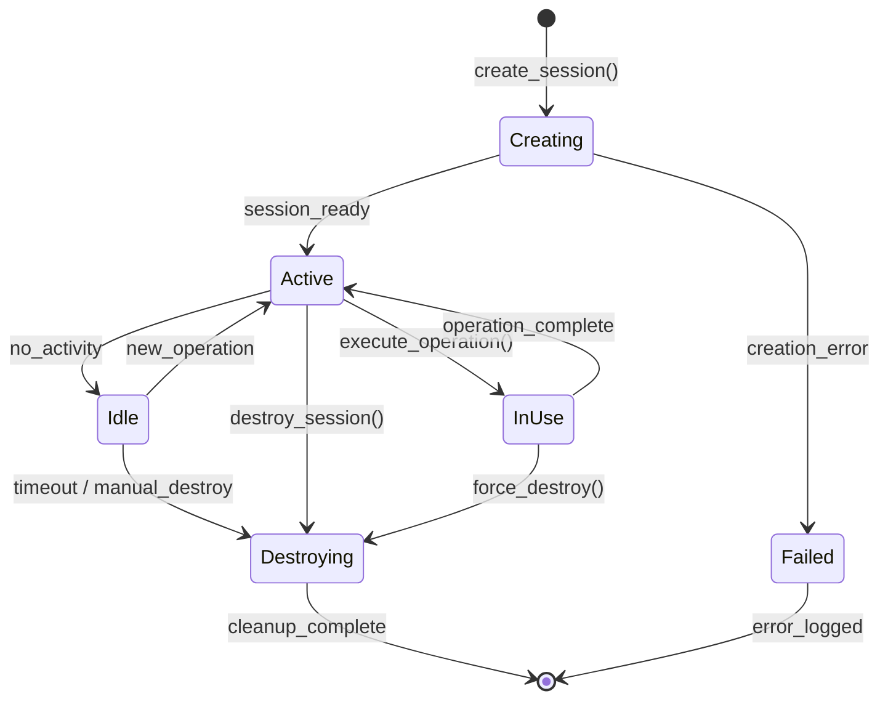

**主要接口**:
```python
class ACPHarnessManager:
    def create_session(self, config: ACPSessionConfig) -> ACPSession
    def use_session(self, session_id: str) -> ACPSessionContext
    def destroy_session(self, session_id: str, force: bool = False) -> bool
    def list_sessions(self) -> List[ACPSessionInfo]
    def get_session_status(self, session_id: str) -> ACPSessionStatus
    def set_resource_limits(self, session_id: str, limits: ResourceLimits) -> bool
    def get_session_logs(self, session_id: str, filter: LogFilter) -> List[LogEntry]
    def export_session_logs(self, session_id: str, format: str) -> str
    def monitor_session_performance(self, session_id: str) -> PerformanceMetrics
    def configure_network_policy(self, session_id: str, policy: NetworkPolicy) -> bool
    
class ACPDockerClient:
    def build_image(self, session: ACPSession, dockerfile: str, tag: str, build_args: Dict) -> BuildResult
    def run_container(self, session: ACPSession, image: str, config: ContainerConfig) -> Container
    def execute_command(self, session: ACPSession, container_id: str, command: str) -> ExecResult
    def get_container_logs(self, session: ACPSession, container_id: str) -> str
    def stop_container(self, session: ACPSession, container_id: str) -> bool
    def remove_container(self, session: ACPSession, container_id: str) -> bool
    
class ACPGitClient:
    def clone_repository(self, session: ACPSession, repo_url: str, auth: GitAuth) -> str
    def checkout_branch(self, session: ACPSession, repo_path: str, branch: str) -> bool
    def commit_changes(self, session: ACPSession, repo_path: str, message: str) -> str
    def push_changes(self, session: ACPSession, repo_path: str, remote: str, branch: str) -> bool
    
class ACPBuildkitClient:
    def build_multi_arch(self, session: ACPSession, dockerfile: str, platforms: List[str]) -> BuildResult
    def enable_cache(self, session: ACPSession, cache_config: CacheConfig) -> bool
    def build_with_secrets(self, session: ACPSession, dockerfile: str, secrets: Dict[str, str]) -> BuildResult
```

**ACP 配置模型**:
```python
@dataclass
class ACPSessionConfig:
    name: str
    resource_limits: ResourceLimits
    network_policy: NetworkPolicy
    timeout: int = 3600  # 会话超时时间（秒）
    auto_destroy: bool = True  # 任务完成后自动销毁
    enable_qemu: bool = True  # 启用 QEMU 多架构支持
    enable_buildkit: bool = True  # 启用 Buildkit
    git_auth: Optional[GitAuth] = None
    proxy_config: Optional[ProxyConfig] = None
    
@dataclass
class ACPSession:
    session_id: str
    name: str
    status: str  # creating, active, idle, destroying, failed
    created_at: datetime
    last_used_at: datetime
    docker_endpoint: str
    git_endpoint: str
    resource_usage: ResourceUsage
    config: ACPSessionConfig
    
@dataclass
class ACPSessionStatus:
    session_id: str
    status: str
    uptime_seconds: int
    operations_count: int
    resource_usage: ResourceUsage
    health_status: str  # healthy, degraded, unhealthy
    last_error: Optional[str]
    
@dataclass
class NetworkPolicy:
    allow_internet: bool = False
    allowed_hosts: List[str] = field(default_factory=list)
    blocked_ports: List[int] = field(default_factory=list)
    use_proxy: bool = False
    
@dataclass
class GitAuth:
    auth_type: str  # ssh, https, token
    username: Optional[str] = None
    password: Optional[str] = None
    ssh_key: Optional[str] = None
    token: Optional[str] = None
    
@dataclass
class ProxyConfig:
    http_proxy: Optional[str] = None
    https_proxy: Optional[str] = None
    no_proxy: List[str] = field(default_factory=list)
```

**ACP 操作结果模型**:
```python
@dataclass
class ACPBuildResult:
    success: bool
    session_id: str
    image_id: str
    image_tag: str
    platforms: List[str]  # 构建的架构列表
    build_time: float
    build_logs: str
    cache_hits: int
    cache_misses: int
    errors: List[BuildError]
    
@dataclass
class ACPExecutionResult:
    success: bool
    session_id: str
    exit_code: int
    stdout: str
    stderr: str
    execution_time: float
    resource_usage: ResourceUsage
    
@dataclass
class PerformanceMetrics:
    session_id: str
    timestamp: datetime
    cpu_percent: float
    memory_usage_mb: float
    memory_limit_mb: float
    disk_usage_mb: float
    disk_limit_mb: float
    network_rx_bytes: int
    network_tx_bytes: int
    operations_per_minute: float
```

**ACP 错误处理**:
```python
class ACPErrorHandler:
    def handle_session_creation_error(self, error: Exception) -> ACPError:
        """处理会话创建错误"""
        error_msg = str(error).lower()
        
        if "connection refused" in error_msg:
            return ACPError(
                type="connection_failed",
                message="无法连接到 ACP Harness 服务",
                details={"suggestion": "检查 ACP Harness 服务是否运行"},
                recoverable=True
            )
        elif "resource limit" in error_msg or "quota exceeded" in error_msg:
            return ACPError(
                type="resource_exhausted",
                message="ACP 会话资源配额已用尽",
                details={"suggestion": "等待现有会话释放或增加配额"},
                recoverable=True
            )
        elif "timeout" in error_msg:
            return ACPError(
                type="timeout",
                message="ACP 会话创建超时",
                details={"suggestion": "重试创建会话"},
                recoverable=True
            )
        else:
            return ACPError(
                type="unknown_error",
                message=f"ACP 会话创建失败: {error}",
                details={},
                recoverable=False
            )
    
    def handle_docker_operation_error(self, session_id: str, error: Exception) -> ACPError:
        """处理 Docker 操作错误"""
        error_msg = str(error).lower()
        
        if "permission denied" in error_msg:
            return ACPError(
                type="permission_denied",
                message="Docker 操作权限不足",
                details={"session_id": session_id},
                recoverable=False
            )
        elif "image not found" in error_msg:
            return ACPError(
                type="image_not_found",
                message="Docker 镜像不存在",
                details={"session_id": session_id, "suggestion": "先构建镜像"},
                recoverable=True
            )
        elif "network" in error_msg:
            return ACPError(
                type="network_error",
                message="Docker 网络操作失败",
                details={"session_id": session_id},
                recoverable=True
            )
        else:
            return ACPError(
                type="docker_error",
                message=f"Docker 操作失败: {error}",
                details={"session_id": session_id},
                recoverable=False
            )
    
    def handle_session_timeout(self, session_id: str) -> ACPError:
        """处理会话超时"""
        return ACPError(
            type="session_timeout",
            message=f"ACP 会话超时: {session_id}",
            details={"suggestion": "创建新会话并重试操作"},
            recoverable=True
        )
    
    def handle_session_crash(self, session_id: str, crash_info: str) -> ACPError:
        """处理会话崩溃"""
        return ACPError(
            type="session_crashed",
            message=f"ACP 会话崩溃: {session_id}",
            details={"crash_info": crash_info, "suggestion": "检查日志并创建新会话"},
            recoverable=True
        )
```

**ACP 会话恢复机制**:
```python
class ACPSessionRecovery:
    def detect_session_failure(self, session_id: str) -> bool:
        """检测会话故障"""
        try:
            status = self.acp_manager.get_session_status(session_id)
            return status.health_status == "unhealthy"
        except Exception:
            return True
    
    def recover_session(self, session_id: str, config: ACPSessionConfig) -> ACPSession:
        """恢复会话"""
        # 尝试销毁旧会话
        try:
            self.acp_manager.destroy_session(session_id, force=True)
        except Exception as e:
            logger.warning(f"销毁旧会话失败: {e}")
        
        # 创建新会话
        new_session = self.acp_manager.create_session(config)
        logger.info(f"会话恢复成功: {session_id} -> {new_session.session_id}")
        
        return new_session
    
    def retry_operation_with_recovery(
        self, 
        session_id: str, 
        operation: Callable, 
        max_retries: int = 3
    ) -> Any:
        """带恢复机制的操作重试"""
        for attempt in range(max_retries):
            try:
                return operation(session_id)
            except ACPSessionError as e:
                if not e.recoverable or attempt == max_retries - 1:
                    raise
                
                logger.warning(f"操作失败，尝试恢复会话 (尝试 {attempt + 1}/{max_retries})")
                
                # 获取原始配置
                config = self.get_session_config(session_id)
                
                # 恢复会话
                new_session = self.recover_session(session_id, config)
                session_id = new_session.session_id
                
                # 等待会话就绪
                time.sleep(2)
```

#### 13. Frontend Development Support

**职责**: 前端开发流程管理，Vue3 组件处理，Vitest 单元测试，Playwright E2E 测试集成。

**支持的前端技术栈**:
- **Vue3**: 组件识别、响应式语法、Composition API
- **Vitest**: 单元测试执行、覆盖率报告、快照测试
- **Playwright**: 端到端测试、多浏览器支持、视觉回归测试
- **Vite**: 构建工具集成、热重载、开发服务器

**Playwright 集成架构**:
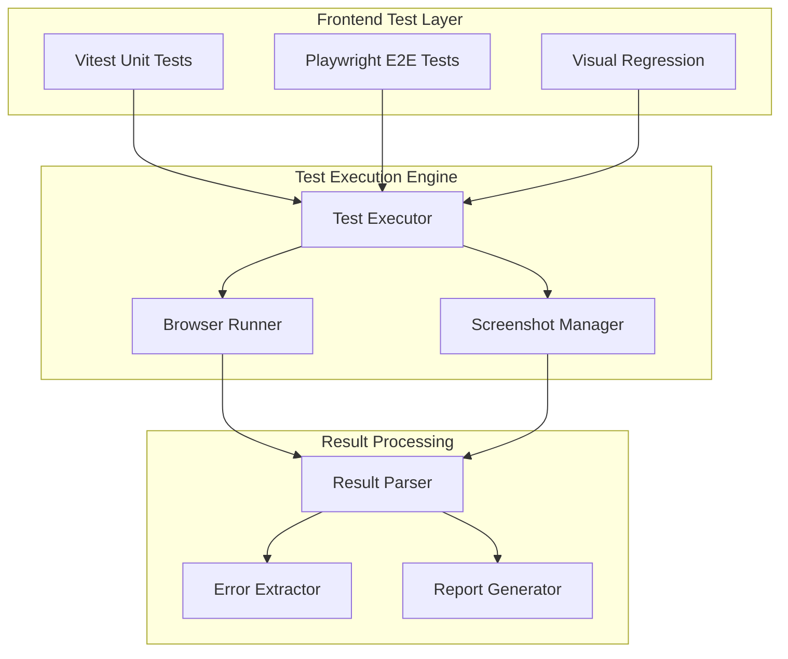

**主要接口**:
```python
class FrontendSupport:
    def detect_framework(self, project_path: str) -> FrameworkInfo
    def run_unit_tests(self, test_path: str) -> TestResult
    def run_e2e_tests(self, config: PlaywrightConfig) -> E2ETestResult
    def build_project(self, build_config: BuildConfig) -> BuildResult
    def start_dev_server(self, port: int = 3000) -> DevServerInfo
    
class PlaywrightManager:
    def setup_browsers(self, browsers: List[str]) -> BrowserSetup
    def run_test_suite(self, test_files: List[str]) -> E2ETestResult
    def capture_screenshots(self, test_name: str) -> List[Screenshot]
    def generate_trace(self, test_name: str) -> TraceFile
    def parse_test_results(self, output: str) -> ParsedResults
```

**Playwright 测试配置**:
```python
@dataclass
class PlaywrightConfig:
    browsers: List[str] = field(default_factory=lambda: ["chromium", "firefox", "webkit"])
    headless: bool = True
    timeout: int = 30000
    retries: int = 2
    screenshot_mode: str = "only-on-failure"
    video_mode: str = "retain-on-failure"
    trace_mode: str = "on-first-retry"
    base_url: str = "http://localhost:3000"
    test_dir: str = "tests/e2e"
    output_dir: str = "test-results"
```

**E2E 测试结果模型**:
```python
@dataclass
class E2ETestResult:
    success: bool
    total_tests: int
    passed_tests: int
    failed_tests: int
    skipped_tests: int
    execution_time: float
    browser_results: Dict[str, BrowserTestResult]
    failed_test_details: List[FailedTest]
    screenshots: List[Screenshot]
    traces: List[TraceFile]
    
@dataclass
class FailedTest:
    test_name: str
    browser: str
    error_message: str
    stack_trace: str
    screenshot_path: Optional[str]
    video_path: Optional[str]
    trace_path: Optional[str]
```

**前端错误解析器**:
```python
class FrontendErrorParser:
    def parse_vitest_output(self, output: str) -> List[TestError]
    def parse_playwright_output(self, output: str) -> List[E2EError]
    def parse_build_errors(self, output: str) -> List[BuildError]
    def extract_vue_errors(self, output: str) -> List[VueError]
    def categorize_error(self, error: str) -> ErrorCategory
```

### 接口规范

#### OpenClaw 标准化接口

系统提供符合 OpenClaw 标准的 Function Calling Schema：

```json
{
  "name": "ralph_engine_execute",
  "description": "执行自治编程任务",
  "parameters": {
    "type": "object",
    "properties": {
      "config_path": {
        "type": "string",
        "description": "配置文件路径"
      },
      "task_ids": {
        "type": "array",
        "items": {"type": "string"},
        "description": "要执行的任务ID列表"
      },
      "options": {
        "type": "object",
        "properties": {
          "async_mode": {"type": "boolean", "default": false},
          "max_retries": {"type": "integer", "default": 3},
          "timeout": {"type": "integer", "default": 1800}
        }
      }
    },
    "required": ["config_path"]
  }
}
```

**响应格式**:
```json
{
  "status": "success|error|in_progress",
  "task_id": "unique_task_id",
  "results": {
    "completed_tasks": ["task_1", "task_2"],
    "failed_tasks": ["task_3"],
    "execution_time": 1234,
    "git_commits": ["abc123", "def456"]
  },
  "errors": [
    {
      "task_id": "task_3",
      "error_type": "compilation_error",
      "message": "语法错误：缺少分号",
      "file": "src/main.go",
      "line": 42
    }
  ]
}
```

## 数据模型

### 核心数据结构

#### Task 模型
```python
@dataclass
class Task:
    id: str
    name: str
    type: TaskType
    status: TaskStatus
    depends_on: List[str]
    ai_engine: str
    config: Dict[str, Any]
    created_at: datetime
    updated_at: datetime
    execution_log: List[LogEntry]
    git_branch: Optional[str] = None
    retry_count: int = 0
    max_retries: int = 3
```

#### Configuration 模型
```python
@dataclass
class Configuration:
    project: ProjectConfig
    tasks: List[TaskConfig]
    settings: SystemSettings
    hooks: Dict[str, List[str]]
    ai_engines: Dict[str, EngineConfig]
```

#### ExecutionResult 模型
```python
@dataclass
class ExecutionResult:
    success: bool
    output: str
    errors: List[ErrorInfo]
    execution_time: float
    resource_usage: ResourceUsage
    security_violations: List[SecurityViolation]
```

#### Frontend 相关数据模型

```python
@dataclass
class FrontendProjectConfig:
    framework: str  # vue3, react, angular
    test_runner: str  # vitest, jest
    e2e_runner: str  # playwright, cypress
    build_tool: str  # vite, webpack, rollup
    package_manager: str  # npm, yarn, pnpm
    
@dataclass
class TestResult:
    success: bool
    test_type: str  # unit, integration, e2e
    total_tests: int
    passed_tests: int
    failed_tests: int
    skipped_tests: int
    execution_time: float
    coverage: Optional[CoverageReport]
    failed_test_details: List[FailedTestDetail]
    
@dataclass
class E2ETestResult(TestResult):
    browser_results: Dict[str, BrowserTestResult]
    screenshots: List[Screenshot]
    videos: List[VideoFile]
    traces: List[TraceFile]
    visual_diffs: List[VisualDiff]
    
@dataclass
class BrowserTestResult:
    browser: str  # chromium, firefox, webkit
    version: str
    success: bool
    tests_run: int
    tests_passed: int
    tests_failed: int
    execution_time: float
    failed_tests: List[FailedTest]
    
@dataclass
class Screenshot:
    test_name: str
    browser: str
    file_path: str
    timestamp: datetime
    test_status: str  # passed, failed, skipped
    
@dataclass
class TraceFile:
    test_name: str
    browser: str
    file_path: str
    size_bytes: int
    timestamp: datetime
    
@dataclass
class VisualDiff:
    test_name: str
    expected_path: str
    actual_path: str
    diff_path: str
    similarity_score: float
    threshold: float
    passed: bool
```

#### ACP 相关数据模型

```python
@dataclass
class ACPConfig:
    harness_endpoint: str  # ACP Harness 服务端点
    api_key: str  # API 认证密钥
    default_timeout: int = 3600  # 默认会话超时（秒）
    max_concurrent_sessions: int = 5  # 最大并发会话数
    enable_auto_recovery: bool = True  # 启用自动恢复
    resource_limits: ResourceLimits = field(default_factory=ResourceLimits)
    network_policy: NetworkPolicy = field(default_factory=NetworkPolicy)
    
@dataclass
class ACPSession:
    session_id: str
    name: str
    status: str  # creating, active, idle, destroying, failed
    created_at: datetime
    last_used_at: datetime
    docker_endpoint: str
    git_endpoint: str
    buildkit_endpoint: str
    resource_usage: ResourceUsage
    config: ACPSessionConfig
    health_status: str  # healthy, degraded, unhealthy
    operations_count: int = 0
    
@dataclass
class ACPSessionConfig:
    name: str
    resource_limits: ResourceLimits
    network_policy: NetworkPolicy
    timeout: int = 3600
    auto_destroy: bool = True
    enable_qemu: bool = True
    enable_buildkit: bool = True
    git_auth: Optional[GitAuth] = None
    proxy_config: Optional[ProxyConfig] = None
    platforms: List[str] = field(default_factory=lambda: ["linux/amd64"])
    
@dataclass
class ACPSessionInfo:
    session_id: str
    name: str
    status: str
    created_at: datetime
    uptime_seconds: int
    operations_count: int
    resource_usage_percent: float
    
@dataclass
class ACPResult:
    success: bool
    session_id: str
    operation_type: str  # build, run, execute, git
    result_data: Dict[str, Any]
    execution_time: float
    resource_usage: ResourceUsage
    logs: str
    errors: List[str]
    
@dataclass
class ACPBuildResult(ACPResult):
    image_id: str
    image_tag: str
    platforms: List[str]
    build_logs: str
    cache_hits: int
    cache_misses: int
    layers: List[LayerInfo]
    
@dataclass
class ACPExecutionResult(ACPResult):
    exit_code: int
    stdout: str
    stderr: str
    container_id: Optional[str] = None
    
@dataclass
class ACPGitResult(ACPResult):
    repo_path: str
    branch: str
    commit_hash: Optional[str] = None
    changes: List[str] = field(default_factory=list)
    
@dataclass
class ACPResourceUsage:
    session_id: str
    timestamp: datetime
    cpu_percent: float
    cpu_limit_cores: float
    memory_usage_mb: float
    memory_limit_mb: float
    disk_usage_mb: float
    disk_limit_mb: float
    network_rx_bytes: int
    network_tx_bytes: int
    container_count: int
    
@dataclass
class ACPPerformanceMetrics:
    session_id: str
    timestamp: datetime
    operations_per_minute: float
    average_operation_time: float
    success_rate: float
    error_rate: float
    resource_usage: ACPResourceUsage
    
@dataclass
class ACPSecurityPolicy:
    session_id: str
    allow_internet: bool
    allowed_hosts: List[str]
    blocked_ports: List[int]
    allow_privileged: bool = False
    allow_host_network: bool = False
    allow_host_pid: bool = False
    max_file_size_mb: int = 1024
    
@dataclass
class ACPAuditLog:
    session_id: str
    timestamp: datetime
    operation_type: str
    operation_details: Dict[str, Any]
    user: str
    success: bool
    error_message: Optional[str] = None
    resource_changes: Dict[str, Any] = field(default_factory=dict)
    
@dataclass
class ACPError:
    type: str  # connection_failed, resource_exhausted, timeout, etc.
    message: str
    details: Dict[str, Any]
    recoverable: bool
    session_id: Optional[str] = None
    timestamp: datetime = field(default_factory=datetime.now)
    
@dataclass
class GitAuth:
    auth_type: str  # ssh, https, token
    username: Optional[str] = None
    password: Optional[str] = None
    ssh_key: Optional[str] = None
    ssh_key_passphrase: Optional[str] = None
    token: Optional[str] = None
    
@dataclass
class ProxyConfig:
    http_proxy: Optional[str] = None
    https_proxy: Optional[str] = None
    no_proxy: List[str] = field(default_factory=list)
    proxy_auth: Optional[str] = None
    
@dataclass
class LogFilter:
    start_time: Optional[datetime] = None
    end_time: Optional[datetime] = None
    log_level: Optional[str] = None  # debug, info, warning, error
    keywords: List[str] = field(default_factory=list)
    limit: int = 1000
```

#### 14. Cost Control Manager

**职责**: 成本控制与资源熔断管理，监控 Token 消耗和任务执行时间，防止 AI 陷入死循环导致费用失控。

**核心功能**:
- **预算管理**: 解析和验证 Token 预算配置
- **成本估算**: 实时估算 LLM 调用成本并累计总消耗
- **预算警告**: 成本接近预算时发出警告
- **强制熔断**: 成本达到预算或超时时强制中止任务
- **死循环检测**: 检测重复的代码变更和错误信息
- **策略切换**: 触发策略切换或中止执行
- **进度保存**: 中止时保存 WIP 分支状态
- **成本报告**: 生成详细的成本报告和执行摘要

**成本控制架构**:
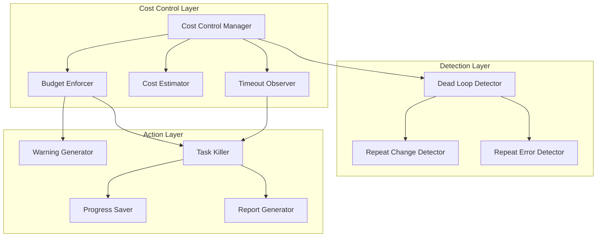

**主要接口**:
```python
class CostControlManager:
    def parse_budget_config(self, config: Dict[str, Any]) -> BudgetConfig
    def estimate_llm_cost(self, engine: str, tokens: int) -> float
    def accumulate_cost(self, cost: float) -> float
    def check_budget_threshold(self, current_cost: float, budget: float) -> BudgetStatus
    def set_global_timeout(self, timeout_seconds: int) -> None
    def check_timeout(self, start_time: datetime) -> bool
    def detect_repeat_changes(self, changes: List[str]) -> bool
    def detect_repeat_errors(self, errors: List[str]) -> bool
    def force_terminate(self, reason: str) -> TerminationResult
    def generate_cost_report(self) -> CostReport
    
class BudgetEnforcer:
    def enforce_budget(self, current_cost: float, budget: float) -> EnforcementAction
    def send_warning(self, warning: BudgetWarning) -> None
    def terminate_task(self, reason: str) -> bool
    
class DeadLoopDetector:
    def detect_repeat_pattern(self, items: List[str], threshold: int = 3) -> bool
    def analyze_change_history(self, commits: List[GitCommit]) -> ChangePattern
    def analyze_error_history(self, errors: List[ErrorInfo]) -> ErrorPattern
    def suggest_strategy_switch(self, pattern: Pattern) -> StrategySuggestion
```

**成本控制配置模型**:
```python
@dataclass
class BudgetConfig:
    max_tokens_budget: float  # 美元金额，如 5.00
    currency: str = "USD"
    warning_threshold: float = 0.9  # 90% 时警告
    global_timeout: int = 1800  # 全局超时（秒），默认 30 分钟
    repeat_change_threshold: int = 3  # 重复变更阈值
    repeat_error_threshold: int = 3  # 重复错误阈值
    enable_auto_terminate: bool = True
    
@dataclass
class CostEstimate:
    engine: str
    input_tokens: int
    output_tokens: int
    cost_per_input_token: float
    cost_per_output_token: float
    total_cost: float
    timestamp: datetime
    
@dataclass
class BudgetStatus:
    current_cost: float
    budget: float
    percentage: float
    remaining: float
    status: str  # safe, warning, critical, exceeded
    
@dataclass
class BudgetWarning:
    timestamp: datetime
    current_cost: float
    budget: float
    percentage: float
    message: str
    severity: str  # info, warning, critical
    
@dataclass
class TerminationResult:
    success: bool
    reason: str
    timestamp: datetime
    final_cost: float
    wip_branch_saved: bool
    progress_snapshot: Dict[str, Any]
    
@dataclass
class CostReport:
    total_cost: float
    budget: float
    budget_exceeded: bool
    llm_calls: List[CostEstimate]
    execution_time: float
    timeout_triggered: bool
    termination_reason: Optional[str]
    tasks_completed: int
    tasks_failed: int
    cost_by_engine: Dict[str, float]
    
@dataclass
class ChangePattern:
    repeat_count: int
    repeated_changes: List[str]
    is_loop: bool
    confidence: float
    
@dataclass
class ErrorPattern:
    repeat_count: int
    repeated_errors: List[str]
    is_stuck: bool
    confidence: float
```

#### 15. Code Index Manager

**职责**: 智能代码库索引管理，使用 AST 工具生成项目符号表，提供代码调用关系分析和上下文构建。

**核心功能**:
- **符号表生成**: 使用 tree-sitter 或 ctags 生成项目符号表
- **调用关系分析**: 检索函数的调用方和被调用方
- **上下文注入**: 在 Prompt 中注入相关代码片段
- **文件树生成**: 生成精简的项目文件树结构
- **模块识别**: 识别模块边界和依赖关系
- **增量更新**: 支持符号表的增量更新
- **智能过滤**: 只索引与任务相关的子目录
- **降级搜索**: 检索失败时降级到文件名搜索

**代码索引架构**:
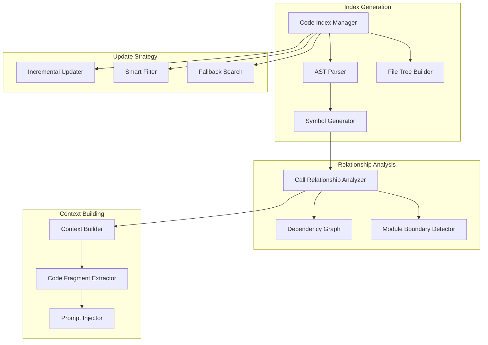

**主要接口**:
```python
class CodeIndexManager:
    def generate_symbol_table(self, project_path: str, language: str) -> SymbolTable
    def update_symbol_table(self, changed_files: List[str]) -> SymbolTable
    def find_callers(self, symbol: Symbol) -> List[CallSite]
    def find_callees(self, symbol: Symbol) -> List[Symbol]
    def build_context(self, symbol: Symbol, depth: int = 2) -> CodeContext
    def generate_file_tree(self, root_path: str, exclude_patterns: List[str]) -> FileTree
    def detect_module_boundaries(self, project_path: str) -> List[Module]
    def analyze_dependencies(self, module: Module) -> DependencyGraph
    def search_by_name(self, name: str) -> List[Symbol]
    
class ASTParser:
    def parse_file(self, file_path: str, language: str) -> AST
    def extract_symbols(self, ast: AST) -> List[Symbol]
    def extract_calls(self, ast: AST) -> List[CallSite]
    def extract_imports(self, ast: AST) -> List[Import]
    
class CallRelationshipAnalyzer:
    def build_call_graph(self, symbols: List[Symbol]) -> CallGraph
    def find_call_chain(self, from_symbol: Symbol, to_symbol: Symbol) -> List[Symbol]
    def detect_circular_calls(self, call_graph: CallGraph) -> List[List[Symbol]]
    
class ContextBuilder:
    def build_prompt_context(self, symbol: Symbol, callers: List[CallSite]) -> str
    def extract_code_fragment(self, file_path: str, start_line: int, end_line: int) -> str
    def format_context(self, fragments: List[CodeFragment]) -> str
```

**代码索引数据模型**:
```python
@dataclass
class SymbolTable:
    project_path: str
    language: str
    symbols: Dict[str, Symbol]
    call_graph: CallGraph
    last_updated: datetime
    indexed_files: List[str]
    
@dataclass
class Symbol:
    name: str
    kind: str  # function, class, method, variable
    file_path: str
    start_line: int
    end_line: int
    signature: str
    docstring: Optional[str]
    parent: Optional[str]  # 父类或父函数
    
@dataclass
class CallSite:
    caller: Symbol
    callee: Symbol
    file_path: str
    line_number: int
    context: str  # 调用上下文代码
    
@dataclass
class CallGraph:
    nodes: Dict[str, Symbol]
    edges: List[Tuple[str, str]]  # (caller_name, callee_name)
    
@dataclass
class CodeContext:
    target_symbol: Symbol
    callers: List[CallSite]
    callees: List[Symbol]
    related_code: List[CodeFragment]
    file_tree: FileTree
    
@dataclass
class CodeFragment:
    file_path: str
    start_line: int
    end_line: int
    code: str
    symbol: Optional[Symbol]
    
@dataclass
class FileTree:
    root_path: str
    structure: Dict[str, Any]  # 嵌套字典表示目录结构
    total_files: int
    total_dirs: int
    
@dataclass
class Module:
    name: str
    path: str
    exports: List[Symbol]
    imports: List[Import]
    dependencies: List[str]  # 依赖的其他模块
    
@dataclass
class Import:
    module: str
    symbols: List[str]
    alias: Optional[str]
    file_path: str
    line_number: int
    
@dataclass
class DependencyGraph:
    modules: Dict[str, Module]
    edges: List[Tuple[str, str]]  # (from_module, to_module)
```

#### 16. Strategy Manager

**职责**: 动态策略切换管理，在一种方法行不通时自动切换到其他策略，避免死磕同一个问题。

**核心功能**:
- **失败模式识别**: 记录和分析连续失败的模式
- **策略切换**: 从 Direct Coding 切换到 Diagnostic Mode 或其他策略
- **诊断模式**: 生成调试代码并分析输出
- **错误类型识别**: 识别特定关键词的错误类型
- **Web 搜索集成**: 允许 Agent 搜索解决方案
- **多策略尝试**: 支持多种策略的顺序尝试
- **成功记录**: 记录成功的策略供后续参考
- **人工介入**: 所有策略失败时请求人工介入

**策略切换架构**:
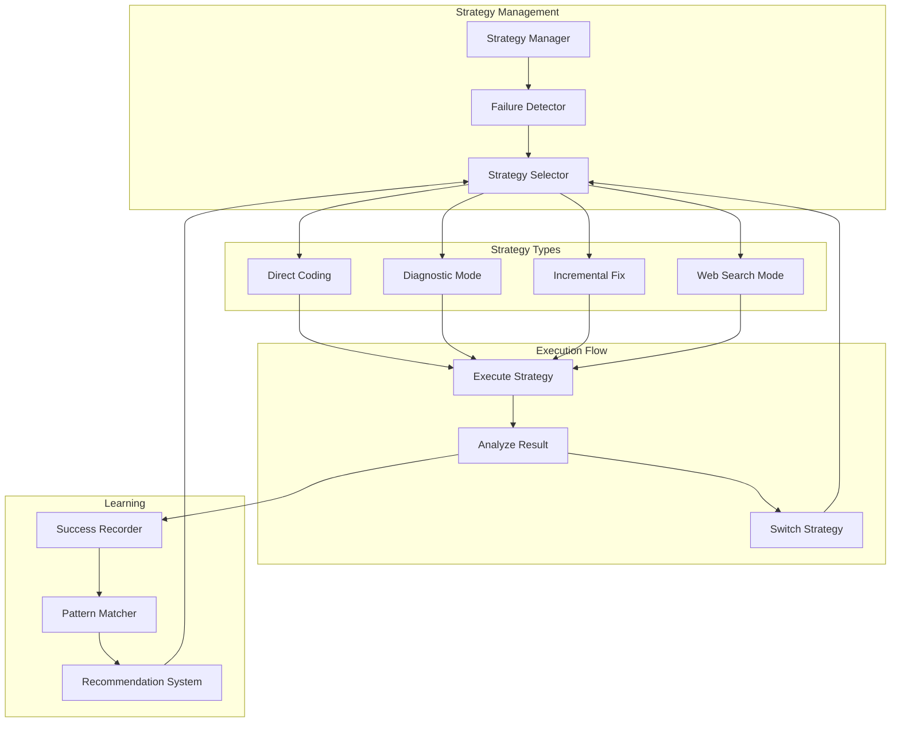

**主要接口**:
```python
class StrategyManager:
    def record_failure(self, task_id: str, error: ErrorInfo) -> None
    def analyze_failure_pattern(self, task_id: str) -> FailurePattern
    def select_strategy(self, pattern: FailurePattern, attempt: int) -> Strategy
    def execute_strategy(self, strategy: Strategy, context: TaskContext) -> StrategyResult
    def switch_strategy(self, current: Strategy, reason: str) -> Strategy
    def record_success(self, task_id: str, strategy: Strategy) -> None
    def get_recommended_strategy(self, task_type: str, error_type: str) -> Strategy
    
class DiagnosticMode:
    def generate_debug_code(self, error: ErrorInfo) -> str
    def execute_debug_code(self, code: str) -> DebugOutput
    def analyze_debug_output(self, output: DebugOutput) -> DiagnosticReport
    def identify_error_type(self, error: ErrorInfo) -> ErrorType
    
class WebSearchMode:
    def should_search(self, error_type: ErrorType) -> bool
    def generate_search_query(self, error: ErrorInfo) -> str
    def extract_solutions(self, search_results: List[SearchResult]) -> List[Solution]
    def apply_solution(self, solution: Solution, context: TaskContext) -> ApplyResult
    
class IncrementalFixMode:
    def decompose_problem(self, error: ErrorInfo) -> List[SubProblem]
    def fix_incrementally(self, problems: List[SubProblem]) -> List[FixResult]
    def verify_partial_fix(self, fix: FixResult) -> bool
```

**策略管理数据模型**:
```python
@dataclass
class Strategy:
    name: str  # direct_coding, diagnostic_mode, incremental_fix, web_search
    description: str
    max_attempts: int
    timeout: int
    config: Dict[str, Any]
    
@dataclass
class FailurePattern:
    task_id: str
    failure_count: int
    consecutive_failures: int
    error_types: List[str]
    repeated_errors: List[str]
    is_stuck: bool
    confidence: float
    
@dataclass
class StrategyResult:
    success: bool
    strategy: Strategy
    execution_time: float
    output: str
    errors: List[ErrorInfo]
    next_action: str  # continue, switch, abort
    
@dataclass
class DiagnosticReport:
    error_type: ErrorType
    root_cause: str
    debug_output: str
    suggested_fixes: List[str]
    confidence: float
    
@dataclass
class ErrorType:
    category: str  # syntax, runtime, logic, dependency, configuration
    keywords: List[str]
    is_searchable: bool
    severity: str  # low, medium, high, critical
    
@dataclass
class Solution:
    source: str  # stackoverflow, github, documentation
    url: str
    title: str
    code_examples: List[str]
    explanation: str
    relevance_score: float
    
@dataclass
class DebugOutput:
    stdout: str
    stderr: str
    logs: List[str]
    variables: Dict[str, Any]
    stack_trace: Optional[str]
    
@dataclass
class StrategyHistory:
    task_id: str
    strategies_tried: List[Strategy]
    results: List[StrategyResult]
    successful_strategy: Optional[Strategy]
    total_attempts: int
    total_time: float
```

#### 17. Event Stream Manager

**职责**: 结构化事件流管理，输出 JSONL 格式的实时事件流，支持前端绘制进度条和状态图。

**核心功能**:
- **事件生成**: 生成标准化的 JSONL 事件
- **实时输出**: 通过 stdout 或特定 pipe 输出事件流
- **事件类型**: 支持多种事件类型（task_start、step_update、git_commit 等）
- **进度估算**: 根据剩余任务和平均耗时估算完成时间
- **格式验证**: 确保 JSONL 格式正确性
- **事件过滤**: 支持按类型和级别过滤事件
- **事件聚合**: 聚合统计信息
- **流式传输**: 支持 SSE 或 WebSocket 协议

**事件流架构**:
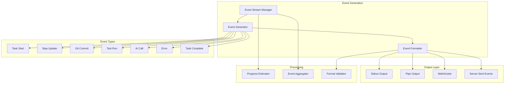

**主要接口**:
```python
class EventStreamManager:
    def emit_event(self, event: Event) -> None
    def emit_task_start(self, task_id: str, task_name: str) -> None
    def emit_step_update(self, step: str, status: str, progress: float) -> None
    def emit_git_commit(self, commit_hash: str, message: str) -> None
    def emit_test_run(self, result: TestResult) -> None
    def emit_ai_call(self, engine: str, tokens: int, cost: float) -> None
    def emit_error(self, error_type: str, message: str, details: Dict) -> None
    def emit_task_complete(self, task_id: str, status: str, summary: Dict) -> None
    def estimate_progress(self, completed: int, total: int, avg_time: float) -> ProgressEstimate
    def validate_jsonl(self, line: str) -> bool
    
class EventGenerator:
    def create_event(self, event_type: str, data: Dict[str, Any]) -> Event
    def add_metadata(self, event: Event) -> Event
    def serialize_event(self, event: Event) -> str
    
class ProgressEstimator:
    def calculate_progress(self, completed: int, total: int) -> float
    def estimate_remaining_time(self, completed: int, total: int, avg_time: float) -> float
    def update_average_time(self, task_time: float) -> float
```

**事件流数据模型**:
```python
@dataclass
class Event:
    event_type: str
    timestamp: datetime
    task_id: Optional[str]
    data: Dict[str, Any]
    metadata: Dict[str, Any]
    
@dataclass
class TaskStartEvent(Event):
    task_id: str
    task_name: str
    task_type: str
    estimated_duration: Optional[float]
    
@dataclass
class StepUpdateEvent(Event):
    step: str
    status: str  # pending, in_progress, completed, failed
    progress: float  # 0.0 to 1.0
    message: Optional[str]
    
@dataclass
class GitCommitEvent(Event):
    commit_hash: str
    message: str
    branch: str
    files_changed: int
    
@dataclass
class TestRunEvent(Event):
    test_type: str  # unit, integration, e2e
    total_tests: int
    passed: int
    failed: int
    skipped: int
    duration: float
    
@dataclass
class AICallEvent(Event):
    engine: str
    model: str
    input_tokens: int
    output_tokens: int
    cost: float
    duration: float
    
@dataclass
class ErrorEvent(Event):
    error_type: str
    error_message: str
    severity: str  # low, medium, high, critical
    stack_trace: Optional[str]
    recoverable: bool
    
@dataclass
class TaskCompleteEvent(Event):
    task_id: str
    status: str  # completed, failed, cancelled
    duration: float
    summary: Dict[str, Any]
    
@dataclass
class ProgressEstimate:
    current_progress: float  # 0.0 to 1.0
    completed_tasks: int
    total_tasks: int
    estimated_remaining_time: float  # 秒
    estimated_completion_time: datetime
    average_task_time: float
```

### 数据流程

#### 任务执行流程
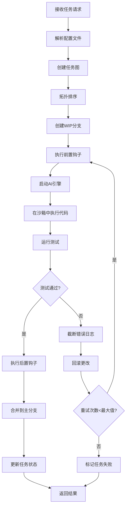

#### 前端开发流程
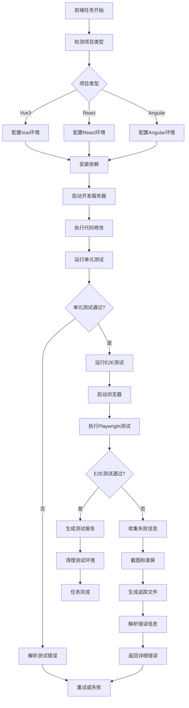

#### Python 开发流程
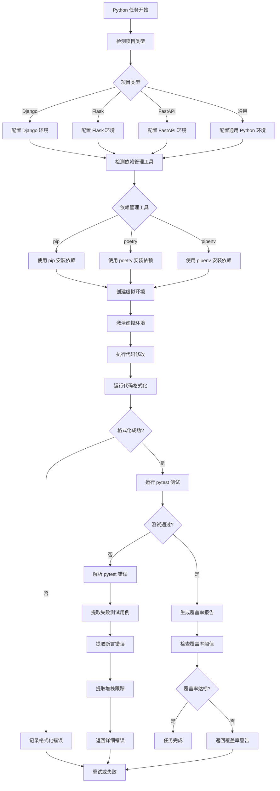

#### Docker 容器化测试流程


#### Playwright E2E 测试流程
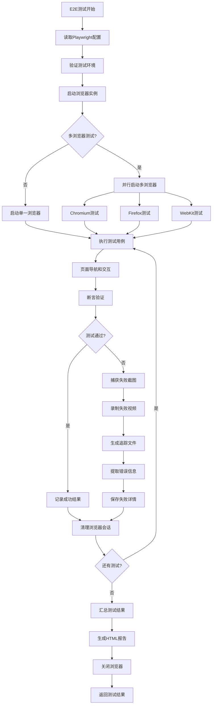

#### 上下文管理流程
```mermaid
flowchart TD
    A[接收输出] --> B{长度>阈值?}
    B -->|否| C[直接返回]
    B -->|是| D[提取错误信息]
    D --> E[保留前2000字符]
    E --> F[保留后2000字符]
    F --> G[添加截断标记]
    G --> H[组合最终输出]
    H --> I[更新上下文统计]
    I --> J[返回截断结果]
```

#### Git 管理流程
```mermaid
flowchart TD
    A[任务开始] --> B[生成分支名称]
    B --> C[创建WIP分支]
    C --> D[切换到WIP分支]
    D --> E[执行代码修改]
    E --> F[提交更改]
    F --> G{测试结果}
    G -->|通过| H[切换到主分支]
    G -->|失败| I[执行回滚]
    H --> J[合并WIP分支]
    I --> K[重置到安全状态]
    J --> L[删除WIP分支]
    K --> M[切换到主分支]
    L --> N[任务完成]
    M --> O[准备重试]
```

## 正确性属性

*属性是一个特征或行为，应该在系统的所有有效执行中保持为真——本质上，是关于系统应该做什么的正式声明。属性作为人类可读规范和机器可验证正确性保证之间的桥梁。*

### 属性 1: Git 分支自动创建

*对于任何* 代码修改任务，当 Worker_Agent 开始修改代码时，Git_Manager 应当自动创建唯一的 WIP_Branch

**验证: 需求 1.1, 1.4**

### 属性 2: 失败任务自动回滚

*对于任何* 执行失败的任务，Git_Manager 应当执行 git reset --hard 回滚到安全状态

**验证: 需求 1.2**

### 属性 3: 成功任务自动合并

*对于任何* 测试通过的任务，Git_Manager 应当自动将 WIP_Branch 合并回主分支

**验证: 需求 1.3**

### 属性 4: 冲突信息记录

*对于任何* 发生合并冲突的情况，Git_Manager 应当记录冲突信息并通知 Master_Agent

**验证: 需求 1.5**

### 属性 5: 长输出自动截断

*对于任何* 超过 10000 字符的测试输出，Context_Manager 应当截断日志并保留关键错误信息

**验证: 需求 2.1**

### 属性 6: 错误信息识别保留

*对于任何* 包含编译错误、运行时错误或测试失败信息的输出，Context_Manager 应当正确识别并保留这些关键信息

**验证: 需求 2.2**

### 属性 7: 上下文大小管理

*对于任何* 超过配置阈值的上下文，Context_Manager 应当触发清理机制

**验证: 需求 2.3**

### 属性 8: 错误优先级管理

*对于任何* 包含多种错误的场景，Context_Manager 应当维护优先级队列，优先保留最重要的错误

**验证: 需求 2.4**

### 属性 9: 截断标记添加

*对于任何* 发生截断的情况，Context_Manager 应当在日志中标记截断位置和原因

**验证: 需求 2.5**

### 属性 10: 依赖任务执行顺序

*对于任何* 包含 depends_on 字段的任务，Task_Manager 应当在依赖任务完成后才开始执行

**验证: 需求 3.2**

### 属性 11: 状态变更通知

*对于任何* 任务状态变更，Task_Manager 应当通知相关的依赖任务

**验证: 需求 3.3**

### 属性 12: 循环依赖检测

*对于任何* 包含循环依赖的任务图，Task_Manager 应当拒绝执行并返回错误信息

**验证: 需求 3.4**

### 属性 13: 前置钩子执行

*对于任何* 任务开始前，Hook_System 应当执行 pre-test 钩子运行代码格式化工具

**验证: 需求 4.1**

### 属性 14: 后置钩子执行

*对于任何* 任务完成后，Hook_System 应当执行 post-test 钩子清理临时文件

**验证: 需求 4.2**

### 属性 15: 钩子失败处理

*对于任何* 钩子执行失败的情况，Hook_System 应当记录失败原因并决定是否继续任务执行

**验证: 需求 4.3**

### 属性 16: 自动修复提交

*对于任何* pre-test 钩子修复语法错误的情况，Hook_System 应当自动提交修复

**验证: 需求 4.5**

### 属性 17: 参数验证

*对于任何* 函数调用请求，Ralph_Engine 应当验证参数格式和必需字段

**验证: 需求 5.2**

### 属性 18: 响应格式一致性

*对于任何* 调用场景，Ralph_Engine 应当返回标准化的响应格式包含状态码和结果数据

**验证: 需求 5.3**

### 属性 19: 接口一致性保持

*对于任何* AI_Engine 切换，Function_Schema 接口应当保持一致性

**验证: 需求 5.4**

### 属性 20: 引擎切换一致性

*对于任何* AI_Engine 切换，Ralph_Engine 应当保持任务执行的一致性

**验证: 需求 6.3**

### 属性 21: 统一接口规范

*对于任何* AI_Engine，都应当实现统一的接口规范

**验证: 需求 6.4**

### 属性 22: 引擎故障转移

*对于任何* AI_Engine 不可用的情况，Ralph_Engine 应当自动切换到备用引擎

**验证: 需求 6.5**

### 属性 23: Vitest 错误解析

*对于任何* 前端测试失败的情况，Ralph_Engine 应当解析 Vitest 错误输出并提取关键信息

**验证: 需求 7.4**

### 属性 24: Playwright 错误解析

*对于任何* Playwright 测试失败的情况，Ralph_Engine 应当解析测试结果并提取失败的测试用例、错误信息和截图路径

**验证: 需求 7.7**

### 属性 25: E2E 测试工作流集成

*对于任何* 代码变更，Ralph_Engine 应当自动运行相关的 Playwright E2E 测试

**验证: 需求 7.8**

### 属性 26: Playwright 错误诊断

*对于任何* Playwright 测试超时或浏览器启动失败的情况，Ralph_Engine 应当提供清晰的错误诊断信息

**验证: 需求 7.9**

### 属性 27: Go 测试错误解析

*对于任何* 后端测试失败的情况，Ralph_Engine 应当解析 Go 测试输出并提取错误信息

**验证: 需求 8.4**

### 属性 28: 配置解析往返

*对于任何* 有效的 Configuration 对象，解析然后打印然后解析应当产生等价对象

**验证: 需求 9.4**

### 属性 29: 有效配置解析

*对于任何* 有效配置文件，Config_Parser 应当解析配置为 Configuration 对象

**验证: 需求 9.1**

### 属性 30: 无效配置错误处理

*对于任何* 无效配置文件，Config_Parser 应当返回描述性错误信息

**验证: 需求 9.2**

### 属性 31: 配置格式化

*对于任何* Configuration 对象，Pretty_Printer 应当格式化为有效的配置文件

**验证: 需求 9.3**

### 属性 32: 文件系统访问限制

*对于任何* 用户代码执行，Safety_Sandbox 应当限制文件系统访问权限

**验证: 需求 10.1**

### 属性 33: 危险操作检测

*对于任何* 危险操作，Safety_Sandbox 应当阻止执行并记录安全事件

**验证: 需求 10.2**

### 属性 34: 网络和系统调用限制

*对于任何* 网络访问和系统调用尝试，Safety_Sandbox 应当正确限制

**验证: 需求 10.3**

### 属性 35: 资源限制管理

*对于任何* 资源使用超过限制的情况，Safety_Sandbox 应当终止执行并清理资源

**验证: 需求 10.4**

### 属性 36: Python 项目特征识别

*对于任何* Python 项目，Ralph_Engine 应当正确识别项目类型（Django、Flask、FastAPI）和依赖管理工具（pip、poetry、pipenv）

**验证: 需求 8.5, 8.6**

### 属性 37: Pytest 测试执行

*对于任何* Python 项目，Ralph_Engine 应当支持 pytest 测试框架的集成和测试执行

**验证: 需求 8.7**

### 属性 38: Pytest 错误解析

*对于任何* pytest 测试失败的情况，Ralph_Engine 应当解析 pytest 输出并提取失败的测试用例、断言错误和堆栈跟踪

**验证: 需求 8.8**

### 属性 39: Python 代码格式化

*对于任何* Python 代码文件，Ralph_Engine 应当支持使用 black、isort、autopep8 或 ruff 进行代码格式化

**验证: 需求 8.9**

### 属性 40: Python 自动格式化

*对于任何* 存在格式问题的 Python 项目，Hook_System 应当在 pre-test 钩子中自动运行格式化工具

**验证: 需求 8.10**

### 属性 41: Python 虚拟环境管理

*对于任何* Python 项目，Ralph_Engine 应当支持创建、激活和管理虚拟环境（venv、virtualenv）

**验证: 需求 8.11**

### 属性 42: Docker 配置识别

*对于任何* 包含 Dockerfile 或 docker-compose.yml 的项目，Ralph_Engine 应当正确识别 Docker 容器化配置

**验证: 需求 11.1, 11.2**

### 属性 43: 容器化测试执行

*对于任何* Docker 容器化项目，Ralph_Engine 应当支持在容器中运行测试套件

**验证: 需求 11.3**

### 属性 44: 容器测试失败处理

*对于任何* 容器化测试失败的情况，Ralph_Engine 应当收集容器日志并提取错误信息

**验证: 需求 11.4**

### 属性 45: Docker 镜像构建

*对于任何* Dockerfile，Ralph_Engine 应当支持镜像构建和标签管理

**验证: 需求 11.5**

### 属性 46: Docker 构建错误解析

*对于任何* Docker 构建失败的情况，Ralph_Engine 应当解析构建输出并识别失败的构建步骤

**验证: 需求 11.6**

### 属性 47: 容器健康检查

*对于任何* Docker 容器，Ralph_Engine 应当支持健康检查和服务就绪状态验证

**验证: 需求 11.7**

### 属性 48: 容器启动失败诊断

*对于任何* 容器启动超时或健康检查失败的情况，Ralph_Engine 应当提供详细的诊断信息

**验证: 需求 11.8**

### 属性 49: 容器资源限制

*对于任何* Docker 容器，Ralph_Engine 应当支持配置和验证资源限制（CPU、内存、磁盘）

**验证: 需求 11.9**

### 属性 50: 容器网络配置

*对于任何* Docker 容器，Ralph_Engine 应当支持网络配置和端口映射管理

**验证: 需求 11.10**

### 属性 51: 多服务编排

*对于任何* 需要多个服务协同测试的场景，Ralph_Engine 应当使用 Docker Compose 正确编排服务启动顺序

**验证: 需求 11.11**

### 属性 52: 容器资源清理

*对于任何* 测试场景，Ralph_Engine 应当在测试完成后自动清理容器和相关资源

**验证: 需求 11.12**

### 属性 53: PostgreSQL 连接管理

*对于任何* 包含 PostgreSQL 配置的项目，Database_Manager 应当成功建立数据库连接并验证连接状态

**验证: 需求 8.13**

### 属性 54: PostgreSQL 查询执行

*对于任何* 有效的 SQL 查询，PostgreSQL_Client 应当执行查询并返回正确格式的结果

**验证: 需求 8.14**

### 属性 55: PostgreSQL 连接错误处理

*对于任何* PostgreSQL 连接失败的情况，Database_Manager 应当返回包含主机、端口和认证状态的详细错误信息

**验证: 需求 8.15**

### 属性 56: Redis 连接管理

*对于任何* 包含 Redis 配置的项目，Cache_Manager 应当成功建立 Redis 连接并验证连接状态

**验证: 需求 8.16**

### 属性 57: Redis 基本操作

*对于任何* Redis 键值对，Redis_Client 应当正确执行 GET、SET、DEL、EXPIRE 操作

**验证: 需求 8.17**

### 属性 58: Redis 连接错误处理

*对于任何* Redis 连接失败的情况，Cache_Manager 应当返回包含主机、端口和认证状态的详细错误信息

**验证: 需求 8.18**

### 属性 59: Alembic 迁移识别和执行

*对于任何* 使用 Alembic 的 Python 项目，Migration_Runner 应当识别迁移脚本并正确执行数据库迁移

**验证: 需求 8.19**

### 属性 60: golang-migrate 迁移识别和执行

*对于任何* 使用 golang-migrate 的 Go 项目，Migration_Runner 应当识别迁移文件并正确执行数据库迁移

**验证: 需求 8.20**

### 属性 61: 迁移错误解析

*对于任何* 迁移执行失败的情况，Migration_Runner 应当解析错误输出并提取失败的迁移版本和 SQL 错误

**验证: 需求 8.21**

### 属性 62: 测试数据库生命周期管理

*对于任何* 测试场景，Database_Manager 应当支持测试数据库的创建和清理

**验证: 需求 8.22**

### 属性 63: 测试事务回滚

*对于任何* 测试完成后，Database_Manager 应当执行事务回滚恢复数据库到初始状态

**验证: 需求 8.23**

### 属性 64: PostgreSQL 查询超时处理

*对于任何* 超时的 PostgreSQL 查询，PostgreSQL_Client 应当终止查询并返回超时错误

**验证: 需求 8.24**

### 属性 65: Redis 操作超时处理

*对于任何* 超时的 Redis 操作，Redis_Client 应当终止操作并返回超时错误

**验证: 需求 8.25**

### 属性 66: PostgreSQL 容器启动和就绪验证

*对于任何* docker-compose.yml 中包含 PostgreSQL 服务的配置，Docker_Manager 应当启动容器并验证数据库就绪状态

**验证: 需求 11.13**

### 属性 67: Redis 容器启动和就绪验证

*对于任何* docker-compose.yml 中包含 Redis 服务的配置，Docker_Manager 应当启动容器并验证缓存服务就绪状态

**验证: 需求 11.14**

### 属性 68: PostgreSQL 容器健康检查

*对于任何* PostgreSQL 容器，Docker_Manager 应当执行 pg_isready 健康检查命令验证数据库可用性

**验证: 需求 11.15**

### 属性 69: Redis 容器健康检查

*对于任何* Redis 容器，Docker_Manager 应当执行 redis-cli ping 健康检查命令验证缓存服务可用性

**验证: 需求 11.16**

### 属性 70: 数据库容器初始化脚本执行

*对于任何* 包含初始化脚本的数据库容器，Docker_Manager 应当在容器启动后执行初始化 SQL 脚本

**验证: 需求 11.17**

### 属性 71: 数据库容器数据持久化

*对于任何* 需要持久化的数据库容器，Docker_Manager 应当配置数据卷映射保存数据库文件

**验证: 需求 11.18**

### 属性 72: Redis 容器数据持久化

*对于任何* 需要持久化的 Redis 容器，Docker_Manager 应当配置数据卷映射保存 RDB 或 AOF 文件

**验证: 需求 11.19**

### 属性 73: 数据库容器启动失败错误提取

*对于任何* 数据库容器启动失败的情况，Docker_Manager 应当收集容器日志并提取数据库错误信息

**验证: 需求 11.20**

### 属性 74: Redis 容器启动失败错误提取

*对于任何* Redis 容器启动失败的情况，Docker_Manager 应当收集容器日志并提取 Redis 错误信息

**验证: 需求 11.21**

### 属性 75: 临时数据库容器生命周期管理

*对于任何* 需要数据库的测试环境，Docker_Manager 应当启动临时数据库容器并在测试完成后销毁

**验证: 需求 11.22**

### 属性 76: 数据库容器健康检查超时诊断

*对于任何* 数据库容器健康检查超时的情况，Docker_Manager 应当返回包含容器状态和日志摘要的详细诊断信息

**验证: 需求 11.23**

### 属性 77: 数据库依赖服务启动顺序

*对于任何* 依赖数据库的多服务场景，Docker_Manager 应当确保数据库容器在应用容器之前完全就绪

**验证: 需求 11.24**

### 属性 78: 数据库网络配置错误诊断

*对于任何* 容器网络配置错误导致数据库连接失败的情况，Docker_Manager 应当提供网络诊断信息

**验证: 需求 11.25**

### 属性 79: ACP 会话隔离

*对于任何* ACP_Session，所有 Docker 操作应当在隔离的 Docker-in-Docker 环境中执行，不能直接访问主机 Docker 守护进程

**验证: 需求 13.5, 13.6**

### 属性 80: ACP Docker-in-Docker 安全性

*对于任何* 在 ACP_Session 中执行的容器操作，应当通过 hardened 的 Docker-in-Docker 环境运行，防止容器逃逸和主机资源访问

**验证: 需求 13.5, 13.25**

### 属性 81: ACP Git 集成

*对于任何* 在 ACP_Session 中执行的 Git 操作，应当使用内置的 Git 客户端并支持 SSH 密钥和 HTTPS 令牌认证

**验证: 需求 13.9, 13.10**

### 属性 82: ACP Buildkit 构建

*对于任何* 在 ACP_Session 中构建 Docker 镜像的操作，应当使用 Buildkit 引擎并支持并行构建、缓存优化和多阶段构建

**验证: 需求 13.11, 13.12**

### 属性 83: ACP QEMU multi-arch 支持

*对于任何* 需要构建多架构镜像的场景，ACP_Session 应当提供 QEMU 支持并能够构建 amd64、arm64、armv7 等常见架构

**验证: 需求 13.7, 13.8**

### 属性 84: ACP 资源限制

*对于任何* ACP_Session，应当支持配置资源限制（CPU、内存、磁盘配额），并在资源使用超过限制时触发警告或终止会话

**验证: 需求 13.18, 13.19**

### 属性 85: ACP 会话生命周期管理

*对于任何* ACP_Session，应当在任务完成后自动销毁会话并清理相关资源，或在超时未使用时自动回收

**验证: 需求 13.13, 13.14**

### 属性 86: ACP 日志收集

*对于任何* ACP_Session 执行，应当收集执行日志并提供日志查询接口，支持按时间范围、日志级别和关键字过滤

**验证: 需求 13.20, 13.21, 13.22**

### 属性 87: ACP 网络隔离

*对于任何* ACP_Session，应当提供网络隔离策略，容器无法访问主机网络和敏感资源，并支持自定义网络策略和防火墙规则

**验证: 需求 13.25, 13.26**

### 属性 88: ACP 故障恢复

*对于任何* ACP_Session 崩溃或超时的情况，ACP_Harness 应当检测故障、记录崩溃信息，并支持自动重新创建会话和恢复任务执行

**验证: 需求 13.15, 13.16, 13.17**

### 属性 89: ACP 并发会话管理

*对于任何* 多个任务并发执行的场景，ACP_Harness 应当支持创建多个独立的 ACP_Session 实例，并在会话数量达到限制时排队等待或返回资源不足错误

**验证: 需求 13.32, 13.33**

### 属性 90: ACP 审计日志

*对于任何* ACP_Session 执行的敏感操作，应当记录审计日志包含操作类型、时间戳、执行者和资源变更信息

**验证: 需求 13.31**

### 属性 91: 预算配置解析

*对于任何* 包含 max_tokens_budget 的配置文件，Config_Parser 应当正确解析并验证预算配置

**验证: 需求 14.1**

### 属性 92: 成本实时估算

*对于任何* LLM 调用，Ralph_Engine 应当实时估算成本并累计总消耗

**验证: 需求 14.2**

### 属性 93: 预算警告触发

*对于任何* 成本接近预算 90% 的情况，Ralph_Engine 应当发出警告通知 Master_Agent

**验证: 需求 14.3**

### 属性 94: 预算熔断执行

*对于任何* 成本达到预算 100% 的情况，Ralph_Engine 应当强制中止任务并保存当前进度

**验证: 需求 14.4**

### 属性 95: 全局超时设置

*对于任何* 包含 global_timeout 的配置文件，Task_Manager 应当正确设置全局超时时间

**验证: 需求 14.5**

### 属性 96: 超时优雅退出

*对于任何* 任务总时长超过 global_timeout 的情况，系统应当优雅退出并执行 Cleanup Hook

**验证: 需求 14.6**

### 属性 97: 重复变更检测

*对于任何* 连续 N 次提交相同代码变更的情况，Task_Manager 应当触发死循环警告

**验证: 需求 14.7**

### 属性 98: 重复错误检测

*对于任何* 连续 N 次遇到完全相同报错信息的情况，Task_Manager 应当触发策略切换或中止

**验证: 需求 14.8**

### 属性 99: WIP 分支保存

*对于任何* 强制中止任务的情况，Git_Manager 应当保存当前 WIP 分支状态

**验证: 需求 14.9**

### 属性 100: 成本报告生成

*对于任何* 预算或超时触发的情况，Ralph_Engine 应当生成详细的成本报告和执行摘要

**验证: 需求 14.10**

### 属性 101: 符号表生成

*对于任何* 任务开始前，Context_Manager 应当使用 AST 工具生成项目符号表

**验证: 需求 15.1**

### 属性 102: 符号信息提取

*对于任何* 生成符号表的操作，系统应当提取函数、类、方法的定义摘要和位置信息

**验证: 需求 15.2**

### 属性 103: 调用方检索

*对于任何* Worker_Agent 需要修改的函数，系统应当检索该函数的调用方

**验证: 需求 15.3**

### 属性 104: 调用关系注入

*对于任何* 检索到调用关系的情况，系统应当在 Prompt 中注入调用方和被调用方的代码片段

**验证: 需求 15.4**

### 属性 105: 文件树包含

*对于任何* 构建上下文的操作，系统应当包含当前目录的精简文件树结构

**验证: 需求 15.5**

### 属性 106: 无关目录排除

*对于任何* 生成文件树的操作，系统应当排除 .git、node_modules、__pycache__ 等无关目录

**验证: 需求 15.6**

### 属性 107: 模块边界识别

*对于任何* 包含多个模块的项目，系统应当识别模块边界和依赖关系

**验证: 需求 15.7**

### 属性 108: 符号表增量更新

*对于任何* 符号表更新操作，系统应当支持增量更新而非全量重建

**验证: 需求 15.8**

### 属性 109: 任务相关索引

*对于任何* 代码库过大的情况，系统应当只索引与当前任务相关的子目录

**验证: 需求 15.9**

### 属性 110: 检索降级处理

*对于任何* 检索失败的情况，系统应当降级到基于文件名的简单搜索

**验证: 需求 15.10**

### 属性 111: 失败模式记录

*对于任何* Worker_Agent 连续 3 次修复失败的情况，Task_Manager 应当记录失败模式

**验证: 需求 16.1**

### 属性 112: 策略自动切换

*对于任何* 检测到重复失败的情况，Task_Manager 应当将策略从 "Direct Coding" 切换为 "Diagnostic Mode"

**验证: 需求 16.2**

### 属性 113: 诊断代码生成

*对于任何* 进入 Diagnostic Mode 的情况，系统应当先生成调试代码

**验证: 需求 16.3**

### 属性 114: 诊断报告生成

*对于任何* 调试代码执行后，系统应当分析输出并生成诊断报告

**验证: 需求 16.4**

### 属性 115: 错误类型识别

*对于任何* 错误日志包含特定关键词的情况，系统应当识别错误类型

**验证: 需求 16.5**

### 属性 116: Web 搜索调用

*对于任何* 识别到可搜索错误类型的情况，系统应当允许 Agent 调用 web_search 查找解决方案

**验证: 需求 16.6**

### 属性 117: 解决方案提取

*对于任何* 搜索返回结果的情况，系统应当提取相关代码示例和文档链接

**验证: 需求 16.7**

### 属性 118: 多策略尝试

*对于任何* 策略切换后仍然失败的情况，系统应当尝试第三种策略

**验证: 需求 16.8**

### 属性 119: 失败报告生成

*对于任何* 所有策略都失败的情况，系统应当生成详细的失败报告并请求人工介入

**验证: 需求 16.9**

### 属性 120: 成功策略记录

*对于任何* 策略切换成功的情况，系统应当记录成功的策略以供后续任务参考

**验证: 需求 16.10**

### 属性 121: JSONL 事件输出

*对于任何* 任务执行，Ralph_Engine 应当在 stdout 或特定 pipe 输出 JSONL 格式的事件流

**验证: 需求 17.1**

### 属性 122: 任务开始事件

*对于任何* 任务开始，系统应当输出 task_start 事件包含 task_id 和 timestamp

**验证: 需求 17.2**

### 属性 123: 步骤更新事件

*对于任何* 步骤更新，系统应当输出 step_update 事件包含 step 名称和 status

**验证: 需求 17.3**

### 属性 124: Git 提交事件

*对于任何* Git 提交，系统应当输出 git_commit 事件包含 hash 和 message

**验证: 需求 17.4**

### 属性 125: 测试运行事件

*对于任何* 测试运行，系统应当输出 test_run 事件包含测试结果统计

**验证: 需求 17.5**

### 属性 126: AI 调用事件

*对于任何* AI 调用，系统应当输出 ai_call 事件包含 engine、tokens 和 cost

**验证: 需求 17.6**

### 属性 127: 错误事件

*对于任何* 错误发生，系统应当输出 error 事件包含错误类型和详细信息

**验证: 需求 17.7**

### 属性 128: 任务完成事件

*对于任何* 任务完成，系统应当输出 task_complete 事件包含最终状态和摘要

**验证: 需求 17.8**

### 属性 129: 进度估算

*对于任何* 计算进度的操作，Task_Manager 应当根据剩余任务数和平均耗时估算完成时间

**验证: 需求 17.9**

### 属性 130: JSONL 格式验证

*对于任何* 输出事件的操作，系统应当确保 JSONL 格式的正确性

**验证: 需求 17.10**

## 错误处理

### 错误分类

系统采用分层错误处理机制，将错误分为以下类别：

#### 1. 系统级错误
- **配置错误**: 配置文件格式错误、缺少必需字段
- **依赖错误**: AI 引擎不可用、外部工具缺失
- **资源错误**: 内存不足、磁盘空间不足、网络连接失败

#### 2. 任务级错误
- **编译错误**: 语法错误、类型错误、导入错误
- **运行时错误**: 空指针异常、数组越界、网络超时
- **测试错误**: 单元测试失败、E2E 测试失败、断言错误

#### 3. Git 级错误
- **合并冲突**: 分支合并时的代码冲突
- **权限错误**: Git 操作权限不足
- **仓库状态错误**: 工作目录不干净、分支不存在

#### 4. 前端特定错误
- **构建错误**: Vite/Webpack 构建失败
- **测试框架错误**: Vitest 配置错误、测试文件不存在
- **E2E 测试错误**: Playwright 浏览器启动失败、页面加载超时、元素定位失败

#### 5. Python 特定错误
- **语法错误**: Python 语法错误、缩进错误
- **导入错误**: 模块未找到、循环导入
- **测试错误**: pytest 测试失败、断言错误、fixture 错误
- **依赖错误**: 包未安装、版本冲突
- **虚拟环境错误**: 环境创建失败、激活失败
- **格式化错误**: black/isort 配置错误、格式化失败

#### 6. Docker 特定错误
- **构建错误**: Dockerfile 语法错误、基础镜像拉取失败、构建步骤失败
- **容器错误**: 容器启动失败、健康检查失败、容器崩溃
- **网络错误**: 端口冲突、网络连接失败
- **资源错误**: 内存不足、磁盘空间不足
- **编排错误**: docker-compose 配置错误、服务依赖循环

#### 7. 数据库特定错误
- **连接错误**: 数据库服务器不可达、端口被占用、网络超时
- **认证错误**: 用户名或密码错误、权限不足、SSL 证书验证失败
- **查询错误**: SQL 语法错误、约束违反、死锁
- **迁移错误**: 迁移脚本语法错误、版本冲突、回滚失败
- **容器错误**: 数据库容器启动失败、健康检查超时、初始化脚本失败
- **Redis 错误**: 连接拒绝、认证失败、内存不足、持久化失败
- **事务错误**: 事务超时、隔离级别冲突、回滚失败

### 错误处理策略

#### 自动重试机制
```python
@dataclass
class RetryConfig:
    max_retries: int = 3
    backoff_strategy: str = "exponential"  # linear, exponential, fixed
    base_delay: float = 1.0
    max_delay: float = 60.0
    retry_on_errors: List[str] = field(default_factory=lambda: [
        "network_timeout", "temporary_failure", "resource_unavailable"
    ])
```

#### 错误恢复流程
```mermaid
flowchart TD
    A[错误发生] --> B[错误分类]
    B --> C{可重试?}
    C -->|是| D[检查重试次数]
    C -->|否| E[记录错误]
    D --> F{次数<最大值?}
    F -->|是| G[等待延迟]
    F -->|否| H[标记永久失败]
    G --> I[执行重试]
    I --> J{重试成功?}
    J -->|是| K[继续执行]
    J -->|否| A
    E --> L[触发回滚]
    H --> L
    L --> M[清理资源]
    M --> N[通知上层]
```

#### 前端错误处理特化

**Playwright 错误处理**:
```python
class PlaywrightErrorHandler:
    def handle_browser_launch_failure(self, error: BrowserLaunchError) -> RecoveryAction:
        """处理浏览器启动失败"""
        if "chrome not found" in error.message.lower():
            return RecoveryAction.INSTALL_BROWSER
        elif "port already in use" in error.message.lower():
            return RecoveryAction.KILL_EXISTING_PROCESS
        else:
            return RecoveryAction.RETRY_WITH_DIFFERENT_BROWSER
    
    def handle_test_timeout(self, test: TestCase, timeout: int) -> RecoveryAction:
        """处理测试超时"""
        if test.is_network_dependent():
            return RecoveryAction.INCREASE_TIMEOUT
        elif test.has_animations():
            return RecoveryAction.DISABLE_ANIMATIONS
        else:
            return RecoveryAction.CAPTURE_DEBUG_INFO
    
    def handle_element_not_found(self, selector: str, page: Page) -> RecoveryAction:
        """处理元素定位失败"""
        if self.is_dynamic_content(selector):
            return RecoveryAction.WAIT_FOR_ELEMENT
        elif self.is_selector_outdated(selector):
            return RecoveryAction.UPDATE_SELECTOR
        else:
            return RecoveryAction.CAPTURE_SCREENSHOT
```

**Vitest 错误处理**:
```python
class VitestErrorHandler:
    def parse_test_failure(self, output: str) -> List[TestFailure]:
        """解析 Vitest 测试失败信息"""
        failures = []
        for match in re.finditer(r'FAIL\s+(.+?)\n(.*?)(?=FAIL|\Z)', output, re.DOTALL):
            test_file = match.group(1)
            error_details = match.group(2)
            failures.append(TestFailure(
                file=test_file,
                error=self.extract_error_message(error_details),
                stack_trace=self.extract_stack_trace(error_details)
            ))
        return failures
    
    def suggest_fix(self, failure: TestFailure) -> List[FixSuggestion]:
        """基于错误类型提供修复建议"""
        suggestions = []
        if "ReferenceError" in failure.error:
            suggestions.append(FixSuggestion.ADD_IMPORT)
        elif "TypeError" in failure.error:
            suggestions.append(FixSuggestion.CHECK_TYPE_DEFINITIONS)
        elif "AssertionError" in failure.error:
            suggestions.append(FixSuggestion.UPDATE_EXPECTED_VALUE)
        return suggestions
```

**Python 错误处理**:
```python
class PythonErrorHandler:
    def handle_pytest_failure(self, error: PytestError) -> RecoveryAction:
        """处理 pytest 测试失败"""
        if "ModuleNotFoundError" in error.message:
            return RecoveryAction.INSTALL_MISSING_PACKAGE
        elif "AssertionError" in error.message:
            return RecoveryAction.ANALYZE_ASSERTION
        elif "FixtureNotFound" in error.message:
            return RecoveryAction.CHECK_FIXTURE_DEFINITION
        else:
            return RecoveryAction.RETRY_WITH_VERBOSE
    
    def handle_import_error(self, error: ImportError) -> RecoveryAction:
        """处理导入错误"""
        if "circular import" in error.message.lower():
            return RecoveryAction.REFACTOR_IMPORTS
        elif "no module named" in error.message.lower():
            missing_module = self.extract_module_name(error.message)
            return RecoveryAction.INSTALL_PACKAGE(missing_module)
        else:
            return RecoveryAction.CHECK_PYTHONPATH
    
    def handle_virtual_env_error(self, error: VirtualEnvError) -> RecoveryAction:
        """处理虚拟环境错误"""
        if "permission denied" in error.message.lower():
            return RecoveryAction.CHECK_PERMISSIONS
        elif "already exists" in error.message.lower():
            return RecoveryAction.USE_EXISTING_ENV
        else:
            return RecoveryAction.RECREATE_ENV
    
    def parse_pytest_output(self, output: str) -> List[PytestError]:
        """解析 pytest 输出"""
        errors = []
        # 提取失败的测试用例
        for match in re.finditer(r'FAILED\s+(.+?)::(.*?)\s+-\s+(.*?)(?=\n\n|\Z)', output, re.DOTALL):
            test_file = match.group(1)
            test_name = match.group(2)
            error_message = match.group(3)
            
            errors.append(PytestError(
                test_file=test_file,
                test_name=test_name,
                error_message=error_message,
                assertion_info=self.extract_assertion_info(error_message),
                stack_trace=self.extract_stack_trace(output, test_name)
            ))
        return errors
    
    def extract_assertion_info(self, error_message: str) -> Optional[AssertionInfo]:
        """提取断言详细信息"""
        # 匹配 pytest 的断言输出格式
        match = re.search(r'assert\s+(.+?)\s+(==|!=|>|<|in|not in)\s+(.+)', error_message)
        if match:
            return AssertionInfo(
                actual=match.group(1).strip(),
                comparison_operator=match.group(2),
                expected=match.group(3).strip()
            )
        return None
```

**Docker 错误处理**:
```python
class DockerErrorHandler:
    def handle_build_failure(self, error: BuildError) -> RecoveryAction:
        """处理 Docker 构建失败"""
        if "no such file or directory" in error.message.lower():
            return RecoveryAction.CHECK_DOCKERFILE_PATHS
        elif "failed to fetch" in error.message.lower():
            return RecoveryAction.CHECK_NETWORK_CONNECTION
        elif "manifest unknown" in error.message.lower():
            return RecoveryAction.CHECK_BASE_IMAGE_TAG
        elif "denied" in error.message.lower():
            return RecoveryAction.CHECK_REGISTRY_CREDENTIALS
        else:
            return RecoveryAction.RETRY_BUILD
    
    def handle_container_start_failure(self, error: ContainerError) -> RecoveryAction:
        """处理容器启动失败"""
        if "port is already allocated" in error.message.lower():
            return RecoveryAction.KILL_PROCESS_ON_PORT
        elif "no space left on device" in error.message.lower():
            return RecoveryAction.CLEANUP_DOCKER_RESOURCES
        elif "oom" in error.message.lower():
            return RecoveryAction.INCREASE_MEMORY_LIMIT
        else:
            return RecoveryAction.CHECK_CONTAINER_LOGS
    
    def handle_health_check_failure(self, container: Container, timeout: int) -> RecoveryAction:
        """处理健康检查失败"""
        logs = self.get_container_logs(container.id)
        
        if "connection refused" in logs.lower():
            return RecoveryAction.CHECK_SERVICE_PORT
        elif "timeout" in logs.lower():
            return RecoveryAction.INCREASE_HEALTH_CHECK_TIMEOUT
        elif self.is_service_starting(logs):
            return RecoveryAction.WAIT_LONGER
        else:
            return RecoveryAction.INSPECT_CONTAINER_STATE
    
    def parse_build_errors(self, output: str) -> List[BuildError]:
        """解析 Docker 构建错误"""
        errors = []
        current_step = 0
        
        for line in output.split('\n'):
            # 匹配构建步骤
            step_match = re.match(r'Step (\d+)/\d+ : (.+)', line)
            if step_match:
                current_step = int(step_match.group(1))
            
            # 匹配错误信息
            if line.startswith('ERROR') or 'failed' in line.lower():
                errors.append(BuildError(
                    step_number=current_step,
                    command=self.extract_command(output, current_step),
                    error_message=line,
                    error_type=self.categorize_build_error(line)
                ))
        
        return errors
    
    def categorize_build_error(self, error_line: str) -> str:
        """分类构建错误"""
        if "no such file" in error_line.lower():
            return "file_not_found"
        elif "network" in error_line.lower() or "fetch" in error_line.lower():
            return "network_error"
        elif "permission denied" in error_line.lower():
            return "permission_error"
        elif "syntax" in error_line.lower():
            return "syntax_error"
        else:
            return "unknown_error"
    
    def suggest_fix(self, error: DockerError) -> List[FixSuggestion]:
        """基于错误类型提供修复建议"""
        suggestions = []
        
        if error.error_type == "file_not_found":
            suggestions.append(FixSuggestion(
                action="检查 COPY/ADD 指令的源路径",
                description="确保文件存在于构建上下文中"
            ))
        elif error.error_type == "network_error":
            suggestions.append(FixSuggestion(
                action="检查网络连接和代理设置",
                description="可能需要配置 HTTP_PROXY 和 HTTPS_PROXY"
            ))
        elif error.error_type == "permission_error":
            suggestions.append(FixSuggestion(
                action="检查文件权限和 Docker 守护进程权限",
                description="可能需要使用 sudo 或将用户添加到 docker 组"
            ))
        
        return suggestions
```

**数据库错误处理**:
```python
class DatabaseErrorHandler:
    def handle_connection_error(self, error: DatabaseError) -> RecoveryAction:
        """处理数据库连接错误"""
        if "connection refused" in error.message.lower():
            return RecoveryAction.CHECK_DATABASE_SERVICE
        elif "timeout" in error.message.lower():
            return RecoveryAction.INCREASE_CONNECTION_TIMEOUT
        elif "authentication failed" in error.message.lower():
            return RecoveryAction.CHECK_CREDENTIALS
        elif "database does not exist" in error.message.lower():
            return RecoveryAction.CREATE_DATABASE
        else:
            return RecoveryAction.CHECK_DATABASE_LOGS
    
    def handle_query_error(self, error: QueryError) -> RecoveryAction:
        """处理查询错误"""
        if "syntax error" in error.message.lower():
            return RecoveryAction.FIX_SQL_SYNTAX
        elif "constraint violation" in error.message.lower():
            return RecoveryAction.CHECK_DATA_CONSTRAINTS
        elif "deadlock" in error.message.lower():
            return RecoveryAction.RETRY_WITH_BACKOFF
        elif "timeout" in error.message.lower():
            return RecoveryAction.OPTIMIZE_QUERY
        else:
            return RecoveryAction.ANALYZE_QUERY_PLAN
    
    def handle_migration_error(self, error: MigrationError) -> RecoveryAction:
        """处理迁移错误"""
        if "syntax error" in error.error_message.lower():
            return RecoveryAction.FIX_MIGRATION_SQL
        elif "already exists" in error.error_message.lower():
            return RecoveryAction.CHECK_MIGRATION_VERSION
        elif "constraint" in error.error_message.lower():
            return RecoveryAction.REVIEW_DATA_CONSTRAINTS
        else:
            return RecoveryAction.ROLLBACK_MIGRATION
    
    def handle_redis_error(self, error: RedisError) -> RecoveryAction:
        """处理 Redis 错误"""
        if "connection refused" in error.message.lower():
            return RecoveryAction.CHECK_REDIS_SERVICE
        elif "noauth" in error.message.lower() or "authentication" in error.message.lower():
            return RecoveryAction.CHECK_REDIS_PASSWORD
        elif "oom" in error.message.lower():
            return RecoveryAction.INCREASE_REDIS_MEMORY
        elif "timeout" in error.message.lower():
            return RecoveryAction.INCREASE_REDIS_TIMEOUT
        else:
            return RecoveryAction.CHECK_REDIS_LOGS
    
    def parse_postgresql_error(self, error: Exception) -> DatabaseError:
        """解析 PostgreSQL 错误"""
        error_code = getattr(error, 'pgcode', None)
        error_mapping = {
            '28P01': ('authentication_failed', '数据库认证失败：密码错误'),
            '3D000': ('database_not_found', '数据库不存在'),
            '08006': ('connection_failed', '无法连接到数据库服务器'),
            '42P01': ('table_not_found', '表不存在'),
            '42703': ('column_not_found', '列不存在'),
            '23505': ('unique_violation', '唯一约束违反'),
            '23503': ('foreign_key_violation', '外键约束违反'),
            '40P01': ('deadlock_detected', '检测到死锁'),
            '57014': ('query_canceled', '查询被取消'),
        }
        
        if error_code in error_mapping:
            error_type, message = error_mapping[error_code]
            return DatabaseError(
                type=error_type,
                message=message,
                details={'error_code': error_code, 'original_message': str(error)}
            )
        else:
            return DatabaseError(
                type='unknown_error',
                message=str(error),
                details={'error_code': error_code}
            )
    
    def suggest_fix(self, error: DatabaseError) -> List[FixSuggestion]:
        """基于错误类型提供修复建议"""
        suggestions = []
        
        if error.type == "authentication_failed":
            suggestions.append(FixSuggestion(
                action="检查数据库用户名和密码",
                description="确保配置文件中的凭据正确"
            ))
            suggestions.append(FixSuggestion(
                action="验证数据库用户权限",
                description="确保用户有连接数据库的权限"
            ))
        elif error.type == "connection_failed":
            suggestions.append(FixSuggestion(
                action="检查数据库服务是否运行",
                description="使用 systemctl status postgresql 或 docker ps 检查"
            ))
            suggestions.append(FixSuggestion(
                action="验证主机和端口配置",
                description="确保主机地址和端口号正确"
            ))
            suggestions.append(FixSuggestion(
                action="检查防火墙设置",
                description="确保数据库端口未被防火墙阻止"
            ))
        elif error.type == "database_not_found":
            suggestions.append(FixSuggestion(
                action="创建数据库",
                description="使用 CREATE DATABASE 命令创建数据库"
            ))
            suggestions.append(FixSuggestion(
                action="检查数据库名称拼写",
                description="确保配置中的数据库名称正确"
            ))
        elif error.type == "unique_violation":
            suggestions.append(FixSuggestion(
                action="检查数据唯一性",
                description="确保插入的数据不违反唯一约束"
            ))
            suggestions.append(FixSuggestion(
                action="使用 ON CONFLICT 子句",
                description="考虑使用 INSERT ... ON CONFLICT 处理冲突"
            ))
        elif error.type == "deadlock_detected":
            suggestions.append(FixSuggestion(
                action="重试事务",
                description="死锁通常是暂时的，可以重试"
            ))
            suggestions.append(FixSuggestion(
                action="优化事务顺序",
                description="确保事务以一致的顺序访问资源"
            ))
        
        return suggestions
```

### 错误上报和监控

```python
@dataclass
class ErrorReport:
    error_id: str
    timestamp: datetime
    error_type: str
    error_message: str
    stack_trace: str
    context: Dict[str, Any]
    task_id: Optional[str]
    recovery_actions: List[str]
    resolution_status: str  # pending, resolved, escalated
```

## 测试策略

### 双重测试方法

系统采用单元测试和基于属性的测试相结合的方法：

- **单元测试**: 验证具体示例、边界情况和错误条件
- **属性测试**: 验证跨所有输入的通用属性
- **集成测试**: 验证组件间协作和端到端流程

### 单元测试策略

**测试覆盖范围**:
- 核心组件的所有公共方法
- 错误处理路径和边界条件
- 配置解析和验证逻辑
- Git 操作和状态管理

**前端测试特化**:
```python
class FrontendTestSuite:
    def test_vue_component_detection(self):
        """测试 Vue 组件识别"""
        vue_code = """
        <template>
          <div>{{ message }}</div>
        </template>
        <script setup>
        const message = ref('Hello')
        </script>
        """
        result = self.frontend_support.detect_framework(vue_code)
        assert result.framework == "vue3"
        assert result.version.startswith("3.")
    
    def test_playwright_config_validation(self):
        """测试 Playwright 配置验证"""
        config = PlaywrightConfig(
            browsers=["chromium", "firefox"],
            timeout=30000,
            retries=2
        )
        result = self.playwright_manager.validate_config(config)
        assert result.is_valid
        assert len(result.warnings) == 0
    
    def test_e2e_test_result_parsing(self):
        """测试 E2E 测试结果解析"""
        playwright_output = """
        Running 5 tests using 2 workers
        ✓ test/login.spec.ts:3:1 › should login successfully (1s)
        ✗ test/dashboard.spec.ts:8:1 › should load dashboard (2s)
        """
        result = self.playwright_manager.parse_test_results(playwright_output)
        assert result.total_tests == 2
        assert result.passed_tests == 1
        assert result.failed_tests == 1
```

**Python 测试特化**:
```python
class PythonTestSuite:
    def test_project_type_detection(self):
        """测试 Python 项目类型识别"""
        # Django 项目
        django_structure = {
            "manage.py": "#!/usr/bin/env python",
            "settings.py": "INSTALLED_APPS = []"
        }
        result = self.python_support.detect_project_type(django_structure)
        assert result.framework == "django"
        
        # Flask 项目
        flask_structure = {
            "app.py": "from flask import Flask",
            "requirements.txt": "Flask==2.0.0"
        }
        result = self.python_support.detect_project_type(flask_structure)
        assert result.framework == "flask"
        
        # FastAPI 项目
        fastapi_structure = {
            "main.py": "from fastapi import FastAPI",
            "requirements.txt": "fastapi==0.95.0"
        }
        result = self.python_support.detect_project_type(fastapi_structure)
        assert result.framework == "fastapi"
    
    def test_dependency_manager_detection(self):
        """测试依赖管理工具识别"""
        # pip
        pip_project = {"requirements.txt": "pytest==7.0.0"}
        result = self.python_support.detect_dependency_manager(pip_project)
        assert result == "pip"
        
        # poetry
        poetry_project = {"pyproject.toml": "[tool.poetry]"}
        result = self.python_support.detect_dependency_manager(poetry_project)
        assert result == "poetry"
        
        # pipenv
        pipenv_project = {"Pipfile": "[packages]"}
        result = self.python_support.detect_dependency_manager(pipenv_project)
        assert result == "pipenv"
    
    def test_pytest_result_parsing(self):
        """测试 pytest 结果解析"""
        pytest_output = """
        ============================= test session starts ==============================
        collected 5 items
        
        tests/test_user.py::test_create_user PASSED                              [ 20%]
        tests/test_user.py::test_invalid_email FAILED                            [ 40%]
        tests/test_auth.py::test_login PASSED                                    [ 60%]
        tests/test_auth.py::test_logout PASSED                                   [ 80%]
        tests/test_auth.py::test_invalid_token FAILED                            [100%]
        
        =================================== FAILURES ===================================
        _______________________________ test_invalid_email _____________________________
        
            def test_invalid_email():
        >       assert validate_email("invalid") == False
        E       AssertionError: assert True == False
        
        tests/test_user.py:15: AssertionError
        =========================== short test summary info ============================
        FAILED tests/test_user.py::test_invalid_email - AssertionError: assert True...
        FAILED tests/test_auth.py::test_invalid_token - KeyError: 'token'
        ========================= 2 failed, 3 passed in 0.50s ==========================
        """
        
        result = self.pytest_manager.parse_test_results(pytest_output)
        assert result.total_tests == 5
        assert result.passed_tests == 3
        assert result.failed_tests == 2
        assert len(result.failed_test_details) == 2
        
        # 验证失败详情
        failed_test = result.failed_test_details[0]
        assert failed_test.test_name == "test_invalid_email"
        assert failed_test.test_file == "tests/test_user.py"
        assert "AssertionError" in failed_test.error_type
    
    def test_virtual_env_management(self):
        """测试虚拟环境管理"""
        # 创建虚拟环境
        env_path = "/tmp/test_venv"
        result = self.python_env_manager.create_venv(env_path)
        assert result.success
        assert os.path.exists(env_path)
        
        # 激活虚拟环境
        activation = self.python_env_manager.activate_env(env_path)
        assert activation.success
        
        # 验证 Python 路径
        python_path = self.python_env_manager.get_python_path(env_path)
        assert env_path in python_path
    
    def test_code_formatting(self):
        """测试代码格式化"""
        unformatted_code = """
        def hello(  name  ):
            print(  "Hello, "+name  )
        """
        
        # 使用 black 格式化
        result = self.python_formatter.format_with_black(unformatted_code)
        assert result.success
        assert 'def hello(name):' in result.formatted_code
        assert 'print("Hello, " + name)' in result.formatted_code
```

**Docker 测试特化**:
```python
class DockerTestSuite:
    def test_dockerfile_detection(self):
        """测试 Dockerfile 识别"""
        project_with_dockerfile = {
            "Dockerfile": "FROM python:3.11\nCOPY . /app",
            "app.py": "print('hello')"
        }
        
        result = self.docker_manager.detect_docker_config(project_with_dockerfile)
        assert result.has_dockerfile
        assert result.dockerfile_path == "Dockerfile"
        assert result.base_image == "python:3.11"
    
    def test_compose_file_parsing(self):
        """测试 docker-compose 文件解析"""
        compose_content = """
        version: '3.8'
        services:
          web:
            build: .
            ports:
              - "8000:8000"
            depends_on:
              - db
          db:
            image: postgres:13
            environment:
              POSTGRES_PASSWORD: secret
        """
        
        result = self.container_orchestrator.parse_compose_file(compose_content)
        assert result.version == "3.8"
        assert len(result.services) == 2
        assert "web" in result.services
        assert "db" in result.services
        
        # 验证依赖关系
        web_service = result.services["web"]
        assert "db" in web_service.depends_on
    
    def test_service_dependency_resolution(self):
        """测试服务依赖解析"""
        services = [
            Service(name="web", depends_on=["db", "cache"]),
            Service(name="db", depends_on=[]),
            Service(name="cache", depends_on=["db"]),
            Service(name="worker", depends_on=["db", "cache"])
        ]
        
        ordered = self.container_orchestrator.resolve_service_dependencies(services)
        
        # 验证启动顺序
        service_names = [s.name for s in ordered]
        assert service_names.index("db") < service_names.index("cache")
        assert service_names.index("cache") < service_names.index("web")
        assert service_names.index("db") < service_names.index("worker")
    
    def test_container_health_check(self):
        """测试容器健康检查"""
        container_config = ContainerConfig(
            image="nginx:latest",
            name="test_nginx",
            ports={8080: 80},
            health_check=HealthCheck(
                test="curl -f http://localhost/ || exit 1",
                interval=5,
                timeout=3,
                retries=3
            )
        )
        
        container = self.docker_manager.create_container(container_config)
        self.docker_manager.start_container(container.id)
        
        # 等待健康检查通过
        is_healthy = self.docker_health_checker.wait_for_healthy(
            container.id, 
            timeout=30
        )
        assert is_healthy
        
        # 清理
        self.docker_manager.stop_container(container.id)
        self.docker_manager.remove_container(container.id)
    
    def test_build_error_parsing(self):
        """测试构建错误解析"""
        build_output = """
        Step 1/5 : FROM python:3.11
         ---> abc123def456
        Step 2/5 : COPY requirements.txt /app/
         ---> Using cache
         ---> def456ghi789
        Step 3/5 : RUN pip install -r /app/requirements.txt
         ---> Running in xyz789abc123
        ERROR: Could not find a version that satisfies the requirement nonexistent-package
        ERROR: No matching distribution found for nonexistent-package
        The command '/bin/sh -c pip install -r /app/requirements.txt' returned a non-zero code: 1
        """
        
        errors = self.docker_error_parser.parse_build_errors(build_output)
        assert len(errors) > 0
        
        error = errors[0]
        assert error.step_number == 3
        assert "pip install" in error.command
        assert "nonexistent-package" in error.error_message
    
    def test_container_resource_limits(self):
        """测试容器资源限制"""
        container_config = ContainerConfig(
            image="alpine:latest",
            name="test_limits",
            command="sleep 60",
            resource_limits=ResourceLimits(
                cpu_limit=0.5,
                memory_limit="256m"
            )
        )
        
        container = self.docker_manager.create_container(container_config)
        self.docker_manager.start_container(container.id)
        
        # 验证资源限制
        info = self.docker_manager.inspect_container(container.id)
        assert info.host_config.cpu_quota > 0
        assert info.host_config.memory == 256 * 1024 * 1024
        
        # 清理
        self.docker_manager.stop_container(container.id)
        self.docker_manager.remove_container(container.id)
```

**数据库测试特化**:
```python
class DatabaseTestSuite:
    def test_postgresql_connection(self):
        """测试 PostgreSQL 连接"""
        config = PostgreSQLConfig(
            host="localhost",
            port=5432,
            database="test_db",
            user="test_user",
            password="test_password"
        )
        
        client = self.database_manager.connect_postgresql(config)
        status = self.database_manager.verify_connection(client)
        
        assert status.connected
        assert status.latency_ms < 100
        
        client.close()
    
    def test_postgresql_query_execution(self):
        """测试 PostgreSQL 查询执行"""
        client = self.get_test_postgresql_client()
        
        # 创建测试表
        client.execute_query("""
            CREATE TABLE IF NOT EXISTS test_users (
                id SERIAL PRIMARY KEY,
                name VARCHAR(100),
                email VARCHAR(100) UNIQUE
            )
        """)
        
        # 插入数据
        result = client.execute_query(
            "INSERT INTO test_users (name, email) VALUES (%s, %s) RETURNING id",
            {"name": "张三", "email": "zhangsan@example.com"}
        )
        
        assert result.success
        assert result.rows_affected == 1
        assert len(result.rows) == 1
        
        # 查询数据
        result = client.execute_query(
            "SELECT * FROM test_users WHERE email = %s",
            {"email": "zhangsan@example.com"}
        )
        
        assert result.success
        assert len(result.rows) == 1
        assert result.rows[0]["name"] == "张三"
    
    def test_postgresql_connection_error_handling(self):
        """测试 PostgreSQL 连接错误处理"""
        # 错误的密码
        config = PostgreSQLConfig(
            host="localhost",
            port=5432,
            database="test_db",
            user="test_user",
            password="wrong_password"
        )
        
        with pytest.raises(DatabaseError) as exc_info:
            self.database_manager.connect_postgresql(config)
        
        error = exc_info.value
        assert error.type == "authentication_failed"
        assert "test_user" in error.details
    
    def test_redis_connection(self):
        """测试 Redis 连接"""
        config = RedisConfig(
            host="localhost",
            port=6379,
            password=None,
            db=0
        )
        
        client = self.database_manager.connect_redis(config)
        status = self.database_manager.verify_connection(client)
        
        assert status.connected
        assert client.ping()
        
        client.close()
    
    def test_redis_basic_operations(self):
        """测试 Redis 基本操作"""
        client = self.get_test_redis_client()
        
        # SET 操作
        assert client.set("test_key", "test_value")
        
        # GET 操作
        value = client.get("test_key")
        assert value == "test_value"
        
        # EXPIRE 操作
        assert client.expire("test_key", 60)
        
        # EXISTS 操作
        assert client.exists("test_key")
        
        # DELETE 操作
        assert client.delete("test_key")
        assert not client.exists("test_key")
    
    def test_migration_detection_alembic(self):
        """测试 Alembic 迁移检测"""
        project_structure = {
            "alembic.ini": "[alembic]",
            "alembic/": {
                "versions/": {
                    "001_initial.py": "# migration",
                    "002_add_users.py": "# migration"
                }
            }
        }
        
        tool = self.migration_runner.detect_migration_tool(project_structure)
        assert tool == "alembic"
        
        migrations = self.migration_runner.scan_migrations("alembic/versions")
        assert len(migrations) == 2
    
    def test_migration_detection_golang_migrate(self):
        """测试 golang-migrate 迁移检测"""
        project_structure = {
            "migrations/": {
                "000001_initial.up.sql": "CREATE TABLE users",
                "000001_initial.down.sql": "DROP TABLE users",
                "000002_add_posts.up.sql": "CREATE TABLE posts",
                "000002_add_posts.down.sql": "DROP TABLE posts"
            }
        }
        
        tool = self.migration_runner.detect_migration_tool(project_structure)
        assert tool == "golang-migrate"
        
        migrations = self.migration_runner.scan_migrations("migrations")
        assert len(migrations) == 2
    
    def test_migration_error_parsing(self):
        """测试迁移错误解析"""
        alembic_error = """
        sqlalchemy.exc.ProgrammingError: (psycopg2.errors.UndefinedColumn) 
        column "nonexistent" does not exist
        LINE 1: SELECT nonexistent FROM users
        """
        
        errors = self.migration_runner.parse_migration_error(alembic_error, "alembic")
        assert len(errors) > 0
        
        error = errors[0]
        assert "UndefinedColumn" in error.error_type or "column" in error.error_message.lower()
    
    def test_test_database_lifecycle(self):
        """测试测试数据库生命周期"""
        base_config = PostgreSQLConfig(
            host="localhost",
            port=5432,
            database="main_db",
            user="test_user",
            password="test_password"
        )
        
        # 创建测试数据库
        test_db = self.test_db_manager.create_test_database(base_config)
        assert test_db.name.startswith("test_main_db_")
        
        # 在测试数据库中执行操作
        client = self.database_manager.connect_postgresql(
            base_config.copy(database=test_db.name)
        )
        
        client.execute_query("CREATE TABLE test_table (id INT)")
        client.execute_query("INSERT INTO test_table VALUES (1)")
        
        # 清理测试数据库
        self.test_db_manager.cleanup_test_database(test_db)
        
        # 验证数据库已删除
        with pytest.raises(DatabaseError):
            self.database_manager.connect_postgresql(
                base_config.copy(database=test_db.name)
            )
    
    def test_transaction_rollback(self):
        """测试事务回滚"""
        client = self.get_test_postgresql_client()
        
        # 创建测试表
        client.execute_query("CREATE TABLE test_rollback (id INT)")
        
        # 开始事务
        transaction = client.begin_transaction()
        
        # 在事务中插入数据
        client.execute_query("INSERT INTO test_rollback VALUES (1)")
        client.execute_query("INSERT INTO test_rollback VALUES (2)")
        
        # 验证数据存在
        result = client.execute_query("SELECT COUNT(*) FROM test_rollback")
        assert result.rows[0]["count"] == 2
        
        # 回滚事务
        client.rollback_transaction(transaction)
        
        # 验证数据已回滚
        result = client.execute_query("SELECT COUNT(*) FROM test_rollback")
        assert result.rows[0]["count"] == 0
    
    def test_postgresql_container_startup(self):
        """测试 PostgreSQL 容器启动"""
        config = PostgreSQLContainerConfig(
            version="13",
            container_name="test_postgres",
            database="test_db",
            user="test_user",
            password="test_password",
            host_port=5433,
            data_dir="/tmp/postgres_data"
        )
        
        container = self.db_container_manager.start_postgresql_container(config)
        
        # 验证容器运行
        assert self.docker_manager.inspect_container(container.id).state == "running"
        
        # 验证健康检查
        health = self.docker_health_checker.check_container_health(container.id)
        assert health.status == "healthy"
        
        # 验证可以连接
        db_config = PostgreSQLConfig(
            host="localhost",
            port=5433,
            database="test_db",
            user="test_user",
            password="test_password"
        )
        
        client = self.database_manager.connect_postgresql(db_config)
        assert client.ping()
        client.close()
        
        # 清理
        self.docker_manager.stop_container(container.id)
        self.docker_manager.remove_container(container.id)
    
    def test_redis_container_startup(self):
        """测试 Redis 容器启动"""
        config = RedisContainerConfig(
            version="7",
            container_name="test_redis",
            host_port=6380,
            password="test_password",
            data_dir="/tmp/redis_data"
        )
        
        container = self.db_container_manager.start_redis_container(config)
        
        # 验证容器运行
        assert self.docker_manager.inspect_container(container.id).state == "running"
        
        # 验证健康检查
        health = self.docker_health_checker.check_container_health(container.id)
        assert health.status == "healthy"
        
        # 验证可以连接
        redis_config = RedisConfig(
            host="localhost",
            port=6380,
            password="test_password"
        )
        
        client = self.database_manager.connect_redis(redis_config)
        assert client.ping()
        client.close()
        
        # 清理
        self.docker_manager.stop_container(container.id)
        self.docker_manager.remove_container(container.id)
    
    def test_database_container_init_scripts(self):
        """测试数据库容器初始化脚本"""
        # 创建初始化脚本
        init_script = "/tmp/init.sql"
        with open(init_script, 'w') as f:
            f.write("""
                CREATE TABLE users (
                    id SERIAL PRIMARY KEY,
                    name VARCHAR(100)
                );
                INSERT INTO users (name) VALUES ('初始用户');
            """)
        
        config = PostgreSQLContainerConfig(
            version="13",
            container_name="test_postgres_init",
            database="test_db",
            user="test_user",
            password="test_password",
            host_port=5434,
            init_scripts=[init_script]
        )
        
        container = self.db_container_manager.start_postgresql_container(config)
        
        # 连接并验证初始化脚本已执行
        db_config = PostgreSQLConfig(
            host="localhost",
            port=5434,
            database="test_db",
            user="test_user",
            password="test_password"
        )
        
        client = self.database_manager.connect_postgresql(db_config)
        result = client.execute_query("SELECT * FROM users")
        
        assert len(result.rows) == 1
        assert result.rows[0]["name"] == "初始用户"
        
        client.close()
        
        # 清理
        self.docker_manager.stop_container(container.id)
        self.docker_manager.remove_container(container.id)
        os.remove(init_script)
```

### 基于属性的测试

**配置**: 每个属性测试运行最少 100 次迭代，使用随机生成的输入数据。

**测试标记格式**: `**Feature: ralph-autonomous-engine, Property {number}: {property_text}**`

**示例属性测试**:
```python
@given(st.text(min_size=10001))  # 生成超过阈值的文本
def test_context_truncation_property(self, long_output):
    """**Feature: ralph-autonomous-engine, Property 5: 长输出自动截断**"""
    result = self.context_manager.truncate_output(long_output)
    
    # 验证截断后长度不超过阈值
    assert len(result) <= 10000
    
    # 验证包含截断标记
    assert "[... 截断了" in result
    
    # 验证保留了前后部分
    assert result.startswith(long_output[:2000])
    assert result.endswith(long_output[-2000:])

@given(st.lists(st.text(), min_size=1))
def test_task_dependency_ordering_property(self, task_names):
    """**Feature: ralph-autonomous-engine, Property 10: 依赖任务执行顺序**"""
    # 创建随机依赖关系
    tasks = []
    for i, name in enumerate(task_names):
        depends_on = task_names[:i] if i > 0 else []
        tasks.append(Task(id=name, depends_on=depends_on))
    
    # 执行拓扑排序
    ordered_tasks = self.task_manager.resolve_dependencies(tasks)
    
    # 验证依赖顺序正确
    executed = set()
    for task in ordered_tasks:
        for dep in task.depends_on:
            assert dep in executed, f"依赖 {dep} 应该在 {task.id} 之前执行"
        executed.add(task.id)

@given(st.dictionaries(st.text(), st.text()))
def test_config_roundtrip_property(self, config_data):
    """**Feature: ralph-autonomous-engine, Property 28: 配置解析往返**"""
    # 创建配置对象
    original_config = Configuration(**config_data)
    
    # 往返测试：对象 -> 文件 -> 对象
    config_text = self.config_parser.pretty_print(original_config)
    parsed_config = self.config_parser.parse_config_text(config_text)
    
    # 验证往返后等价
    assert original_config == parsed_config

@given(st.text(min_size=1))
def test_python_project_detection_property(self, project_structure):
    """**Feature: ralph-autonomous-engine, Property 36: Python 项目特征识别**"""
    # 为任何项目结构，检测应该返回有效结果
    result = self.python_support.detect_project_type(project_structure)
    
    # 验证返回的项目类型是有效的
    assert result.framework in ["django", "flask", "fastapi", "none"]
    assert result.dependency_manager in ["pip", "poetry", "pipenv", "none"]

@given(st.text(min_size=1))
def test_pytest_output_parsing_property(self, pytest_output):
    """**Feature: ralph-autonomous-engine, Property 38: Pytest 错误解析**"""
    # 对于任何 pytest 输出，解析应该不会崩溃
    result = self.pytest_manager.parse_test_results(pytest_output)
    
    # 验证基本结构
    assert isinstance(result, PytestResult)
    assert result.total_tests >= 0
    assert result.passed_tests >= 0
    assert result.failed_tests >= 0
    assert result.total_tests == result.passed_tests + result.failed_tests + result.skipped_tests

@given(st.text(min_size=1))
def test_dockerfile_parsing_property(self, dockerfile_content):
    """**Feature: ralph-autonomous-engine, Property 42: Docker 配置识别**"""
    # 对于任何 Dockerfile 内容，解析应该返回有效结果
    result = self.docker_manager.parse_dockerfile(dockerfile_content)
    
    # 验证返回结构
    assert isinstance(result, DockerfileInfo)
    if result.is_valid:
        assert result.base_image is not None

@given(st.lists(st.text(), min_size=2, max_size=10))
def test_docker_service_dependency_property(self, service_names):
    """**Feature: ralph-autonomous-engine, Property 51: 多服务编排**"""
    # 创建随机服务依赖图
    services = []
    for i, name in enumerate(service_names):
        # 随机选择一些之前的服务作为依赖
        depends_on = random.sample(service_names[:i], min(i, 2)) if i > 0 else []
        services.append(Service(name=name, depends_on=depends_on))
    
    # 解析依赖顺序
    ordered = self.container_orchestrator.resolve_service_dependencies(services)
    
    # 验证依赖顺序正确
    started = set()
    for service in ordered:
        for dep in service.depends_on:
            assert dep in started, f"服务 {dep} 应该在 {service.name} 之前启动"
        started.add(service.name)

@given(st.text(min_size=1))
def test_python_code_formatting_property(self, python_code):
    """**Feature: ralph-autonomous-engine, Property 39: Python 代码格式化**"""
    # 对于任何 Python 代码，格式化应该是幂等的
    try:
        first_format = self.python_formatter.format_with_black(python_code)
        if first_format.success:
            second_format = self.python_formatter.format_with_black(first_format.formatted_code)
            # 验证幂等性：格式化两次应该得到相同结果
            assert first_format.formatted_code == second_format.formatted_code
    except SyntaxError:
        # 语法错误的代码无法格式化，这是预期的
        pass

@given(st.integers(min_value=1, max_value=100))
def test_container_resource_limits_property(self, memory_mb):
    """**Feature: ralph-autonomous-engine, Property 49: 容器资源限制**"""
    # 对于任何资源限制配置，容器应该遵守限制
    config = ContainerConfig(
        image="alpine:latest",
        name=f"test_{random.randint(1000, 9999)}",
        command="sleep 10",
        resource_limits=ResourceLimits(
            memory_limit=f"{memory_mb}m"
        )
    )
    
    container = self.docker_manager.create_container(config)
    self.docker_manager.start_container(container.id)
    
    # 验证资源限制被正确应用
    info = self.docker_manager.inspect_container(container.id)
    assert info.host_config.memory == memory_mb * 1024 * 1024
    
    # 清理
    self.docker_manager.stop_container(container.id)
    self.docker_manager.remove_container(container.id)

@given(st.text(min_size=1), st.text(min_size=1))
def test_redis_operations_roundtrip_property(self, key, value):
    """**Feature: ralph-autonomous-engine, Property 57: Redis 基本操作**"""
    # 对于任何键值对，SET 然后 GET 应该返回相同的值
    client = self.get_test_redis_client()
    
    # SET 操作
    client.set(key, value)
    
    # GET 操作
    retrieved_value = client.get(key)
    
    # 验证往返一致性
    assert retrieved_value == value
    
    # 清理
    client.delete(key)

@given(st.text(min_size=1))
def test_postgresql_connection_error_details_property(self, invalid_host):
    """**Feature: ralph-autonomous-engine, Property 55: PostgreSQL 连接错误处理**"""
    # 对于任何无效的主机，错误信息应该包含主机和端口详情
    config = PostgreSQLConfig(
        host=invalid_host,
        port=5432,
        database="test_db",
        user="test_user",
        password="test_password"
    )
    
    try:
        self.database_manager.connect_postgresql(config)
        # 如果连接成功（可能是有效主机），跳过验证
    except DatabaseError as e:
        # 验证错误信息包含必要的详情
        assert e.details is not None
        assert "host" in e.details or invalid_host in str(e)

@given(st.lists(st.text(), min_size=1, max_size=10))
def test_migration_execution_order_property(self, migration_names):
    """**Feature: ralph-autonomous-engine, Property 59: Alembic 迁移识别和执行**"""
    # 对于任何迁移列表，执行顺序应该按版本号排序
    migrations = [
        Migration(version=name, file=f"{name}.py")
        for name in migration_names
    ]
    
    # 排序迁移
    sorted_migrations = self.migration_runner.sort_migrations(migrations)
    
    # 验证排序后的顺序
    for i in range(len(sorted_migrations) - 1):
        assert sorted_migrations[i].version <= sorted_migrations[i + 1].version

@given(st.text(min_size=1))
def test_database_error_parsing_property(self, error_message):
    """**Feature: ralph-autonomous-engine, Property 61: 迁移错误解析**"""
    # 对于任何错误消息，解析应该返回有效的错误对象
    try:
        parsed_error = self.database_error_parser.parse_error(error_message)
        
        # 验证解析结果的基本结构
        assert isinstance(parsed_error, DatabaseError)
        assert parsed_error.type is not None
        assert parsed_error.message is not None
    except Exception:
        # 如果解析失败，应该返回 unknown_error 类型
        pass

@given(st.integers(min_value=1, max_value=100))
def test_test_database_isolation_property(self, num_operations):
    """**Feature: ralph-autonomous-engine, Property 63: 测试事务回滚**"""
    # 对于任何数量的数据库操作，事务回滚应该恢复初始状态
    client = self.get_test_postgresql_client()
    
    # 创建测试表
    client.execute_query("CREATE TABLE IF NOT EXISTS test_isolation (id INT)")
    
    # 记录初始状态
    initial_result = client.execute_query("SELECT COUNT(*) FROM test_isolation")
    initial_count = initial_result.rows[0]["count"]
    
    # 开始事务
    transaction = client.begin_transaction()
    
    # 执行随机数量的插入操作
    for i in range(num_operations):
        client.execute_query(f"INSERT INTO test_isolation VALUES ({i})")
    
    # 回滚事务
    client.rollback_transaction(transaction)
    
    # 验证状态恢复
    final_result = client.execute_query("SELECT COUNT(*) FROM test_isolation")
    final_count = final_result.rows[0]["count"]
    
    assert final_count == initial_count

@given(st.text(min_size=1))
def test_database_container_health_check_property(self, container_name):
    """**Feature: ralph-autonomous-engine, Property 68: PostgreSQL 容器健康检查**"""
    # 对于任何容器名称，健康检查应该返回有效的状态
    try:
        # 假设容器存在
        health = self.docker_health_checker.check_container_health(container_name)
        
        # 验证健康检查结果的结构
        assert health.status in ["healthy", "unhealthy", "starting", "none"]
    except ContainerNotFoundError:
        # 容器不存在是预期的情况
        pass
```

### 集成测试

**端到端工作流测试**:
```python
class IntegrationTestSuite:
    def test_full_frontend_development_workflow(self):
        """测试完整的前端开发工作流"""
        # 1. 创建 Vue3 项目任务
        task_config = TaskConfig(
            name="创建用户登录页面",
            type="frontend_feature",
            frontend=FrontendConfig(
                framework="vue3",
                test_runner="vitest",
                e2e_runner="playwright"
            )
        )
        
        # 2. 执行任务
        result = self.ralph_engine.execute_task(task_config)
        
        # 3. 验证结果
        assert result.success
        assert result.git_commits is not None
        assert result.test_results.unit_tests.success
        assert result.test_results.e2e_tests.success
        
        # 4. 验证生成的文件
        assert os.path.exists("src/components/LoginForm.vue")
        assert os.path.exists("tests/unit/LoginForm.spec.ts")
        assert os.path.exists("tests/e2e/login.spec.ts")
    
    def test_full_backend_development_with_database_workflow(self):
        """测试完整的后端开发工作流（包含数据库）"""
        # 1. 创建后端任务配置
        task_config = TaskConfig(
            name="实现用户认证 API",
            type="backend_feature",
            backend=BackendConfig(
                language="python",
                framework="fastapi",
                database=DatabaseConfig(
                    postgresql=PostgreSQLConfig(
                        host="localhost",
                        port=5432,
                        database="test_db",
                        user="test_user",
                        password="test_password"
                    ),
                    redis=RedisConfig(
                        host="localhost",
                        port=6379
                    ),
                    migration_tool="alembic"
                )
            )
        )
        
        # 2. 启动数据库容器
        pg_container = self.db_container_manager.start_postgresql_container(
            PostgreSQLContainerConfig(
                version="13",
                container_name="test_postgres",
                database="test_db",
                user="test_user",
                password="test_password",
                host_port=5432
            )
        )
        
        redis_container = self.db_container_manager.start_redis_container(
            RedisContainerConfig(
                version="7",
                container_name="test_redis",
                host_port=6379
            )
        )
        
        try:
            # 3. 执行任务
            result = self.ralph_engine.execute_task(task_config)
            
            # 4. 验证结果
            assert result.success
            assert result.database_migrations_applied
            assert result.test_results.unit_tests.success
            
            # 5. 验证数据库连接
            db_client = self.database_manager.connect_postgresql(
                task_config.backend.database.postgresql
            )
            assert db_client.ping()
            
            # 6. 验证 Redis 连接
            redis_client = self.database_manager.connect_redis(
                task_config.backend.database.redis
            )
            assert redis_client.ping()
            
        finally:
            # 清理容器
            self.docker_manager.stop_container(pg_container.id)
            self.docker_manager.remove_container(pg_container.id)
            self.docker_manager.stop_container(redis_container.id)
            self.docker_manager.remove_container(redis_container.id)
    


    def test_playwright_multi_browser_testing(self):
        """测试 Playwright 多浏览器测试"""
        config = PlaywrightConfig(
            browsers=["chromium", "firefox", "webkit"],
            test_files=["tests/e2e/critical-path.spec.ts"]
        )
        
        result = self.playwright_manager.run_test_suite(config)
        
        # 验证所有浏览器都执行了测试
        assert len(result.browser_results) == 3
        assert "chromium" in result.browser_results
        assert "firefox" in result.browser_results
        assert "webkit" in result.browser_results
        
        # 验证测试结果一致性
        for browser, browser_result in result.browser_results.items():
            assert browser_result.tests_run > 0
    
    def test_full_python_development_workflow(self):
        """测试完整的 Python 开发工作流"""
        # 1. 创建 Python 项目任务
        task_config = TaskConfig(
            name="创建用户认证 API",
            type="backend_feature",
            backend=BackendConfig(
                language="python",
                framework="fastapi",
                test_framework="pytest"
            )
        )
        
        # 2. 执行任务
        result = self.ralph_engine.execute_task(task_config)
        
        # 3. 验证结果
        assert result.success
        assert result.git_commits is not None
        
        # 4. 验证虚拟环境创建
        assert os.path.exists(".venv")
        
        # 5. 验证代码格式化
        assert result.formatting_applied
        
        # 6. 验证测试通过
        assert result.test_results.pytest.success
        assert result.test_results.pytest.coverage.total_coverage >= 80.0
        
        # 7. 验证生成的文件
        assert os.path.exists("app/auth.py")
        assert os.path.exists("tests/test_auth.py")
    
    def test_python_pytest_integration(self):
        """测试 Python pytest 集成"""
        # 创建测试项目
        project_path = self.create_test_python_project()
        
        # 配置 pytest
        pytest_config = PytestConfig(
            test_dir="tests",
            coverage=True,
            coverage_threshold=80.0,
            parallel=True,
            num_workers=4
        )
        
        # 运行测试
        result = self.pytest_manager.run_test_suite(
            test_files=["tests/test_*.py"],
            config=pytest_config
        )
        
        # 验证结果
        assert result.total_tests > 0
        assert result.coverage is not None
        assert result.coverage.total_coverage >= 0
        
        # 验证失败测试详情
        if result.failed_tests > 0:
            assert len(result.failed_test_details) == result.failed_tests
            for failed_test in result.failed_test_details:
                assert failed_test.test_name is not None
                assert failed_test.error_message is not None
    
    def test_docker_containerized_testing_workflow(self):
        """测试 Docker 容器化测试工作流"""
        # 1. 创建容器化项目任务
        task_config = TaskConfig(
            name="容器化微服务测试",
            type="backend_feature",
            docker=DockerConfig(
                has_dockerfile=True,
                has_compose=True
            )
        )
        
        # 2. 执行任务
        result = self.ralph_engine.execute_task(task_config)
        
        # 3. 验证镜像构建
        assert result.docker_build.success
        assert result.docker_build.image_id is not None
        
        # 4. 验证容器启动
        assert result.container_started
        
        # 5. 验证健康检查
        assert result.health_check_passed
        
        # 6. 验证测试执行
        assert result.test_results.container_tests.success
        
        # 7. 验证资源清理
        assert result.containers_cleaned_up
    
    def test_docker_compose_multi_service_orchestration(self):
        """测试 Docker Compose 多服务编排"""
        # 创建 docker-compose.yml
        compose_config = ComposeConfig(
            version="3.8",
            services={
                "web": Service(
                    name="web",
                    build=BuildConfig(context=".", dockerfile="Dockerfile"),
                    ports=["8000:8000"],
                    depends_on=["db", "redis"]
                ),
                "db": Service(
                    name="db",
                    image="postgres:13",
                    environment={"POSTGRES_PASSWORD": "secret"}
                ),
                "redis": Service(
                    name="redis",
                    image="redis:6-alpine"
                )
            }
        )
        
        # 启动服务
        result = self.container_orchestrator.start_services(
            list(compose_config.services.values())
        )
        
        # 验证启动顺序
        assert result.start_order == ["db", "redis", "web"]
        
        # 验证所有服务健康
        for service_name in compose_config.services.keys():
            status = self.container_orchestrator.get_service_status(service_name)
            assert status.is_healthy
        
        # 清理
        self.container_orchestrator.stop_services(
            list(compose_config.services.values())
        )
    
    def test_full_stack_development_workflow(self):
        """测试全栈开发工作流（前端 + 后端 + Docker）"""
        # 1. 创建全栈项目任务
        task_config = TaskConfig(
            name="创建完整的用户管理系统",
            type="fullstack_feature",
            frontend=FrontendConfig(
                framework="vue3",
                test_runner="vitest",
                e2e_runner="playwright"
            ),
            backend=BackendConfig(
                language="python",
                framework="fastapi",
                test_framework="pytest"
            ),
            docker=DockerConfig(
                has_dockerfile=True,
                has_compose=True
            )
        )
        
        # 2. 执行任务
        result = self.ralph_engine.execute_task(task_config)
        
        # 3. 验证前端
        assert result.frontend_tests.unit_tests.success
        assert result.frontend_tests.e2e_tests.success
        
        # 4. 验证后端
        assert result.backend_tests.pytest.success
        assert result.backend_tests.pytest.coverage.total_coverage >= 80.0
        
        # 5. 验证容器化
        assert result.docker_build.success
        assert result.container_tests.success
        
        # 6. 验证集成测试
        assert result.integration_tests.success
        
        # 7. 验证 Git 提交
        assert len(result.git_commits) > 0
```

### 性能测试

**基准测试**:
```python
def test_context_truncation_performance(self):
    """测试上下文截断性能"""
    large_output = "x" * 100000  # 100KB 文本
    
    start_time = time.time()
    result = self.context_manager.truncate_output(large_output)
    end_time = time.time()
    
    # 验证性能要求：截断操作应在 100ms 内完成
    assert (end_time - start_time) < 0.1
    assert len(result) <= 10000

def test_playwright_test_execution_performance(self):
    """测试 Playwright 执行性能"""
    config = PlaywrightConfig(
        browsers=["chromium"],
        test_files=["tests/e2e/smoke.spec.ts"]
    )
    
    start_time = time.time()
    result = self.playwright_manager.run_test_suite(config)
    end_time = time.time()
    
    # 验证性能要求：简单 E2E 测试应在 30 秒内完成
    assert (end_time - start_time) < 30
    assert result.success
```

### 测试环境配置

**前端测试环境**:
```yaml
# playwright.config.ts
export default {
  testDir: './tests/e2e',
  timeout: 30000,
  retries: 2,
  use: {
    baseURL: 'http://localhost:3000',
    screenshot: 'only-on-failure',
    video: 'retain-on-failure',
    trace: 'on-first-retry'
  },
  projects: [
    { name: 'chromium', use: { ...devices['Desktop Chrome'] } },
    { name: 'firefox', use: { ...devices['Desktop Firefox'] } },
    { name: 'webkit', use: { ...devices['Desktop Safari'] } }
  ]
}
```

**Python 测试环境**:
```ini
# pytest.ini
[pytest]
testpaths = tests
python_files = test_*.py
python_classes = Test*
python_functions = test_*
addopts = 
    --verbose
    --strict-markers
    --cov=app
    --cov-report=html
    --cov-report=term-missing
    --cov-fail-under=80
markers =
    unit: Unit tests
    integration: Integration tests
    slow: Slow running tests
    
# pyproject.toml (for black, isort, etc.)
[tool.black]
line-length = 88
target-version = ['py311']
include = '\.pyi?$'

[tool.isort]
profile = "black"
line_length = 88
multi_line_output = 3

[tool.pytest.ini_options]
minversion = "7.0"
testpaths = ["tests"]
```

**Docker 测试环境**:
```yaml
# docker-compose.test.yml
version: '3.8'

services:
  test-runner:
    build:
      context: .
      dockerfile: Dockerfile.test
    volumes:
      - .:/app
      - /var/run/docker.sock:/var/run/docker.sock
    environment:
      - PYTHONUNBUFFERED=1
      - PYTEST_ADDOPTS=--verbose --color=yes
    depends_on:
      - test-db
      - test-redis
    command: pytest tests/
  
  test-db:
    image: postgres:13-alpine
    environment:
      POSTGRES_DB: test_db
      POSTGRES_USER: test_user
      POSTGRES_PASSWORD: test_password
    tmpfs:
      - /var/lib/postgresql/data
  
  test-redis:
    image: redis:6-alpine
    tmpfs:
      - /data

# Dockerfile.test
FROM python:3.11-slim

WORKDIR /app

# 安装测试依赖
COPY requirements-test.txt .
RUN pip install --no-cache-dir -r requirements-test.txt

# 安装 Docker CLI（用于容器内测试）
RUN apt-get update && \
    apt-get install -y docker.io && \
    rm -rf /var/lib/apt/lists/*

COPY . .

CMD ["pytest", "tests/"]
```

**测试数据管理**:
```python
class TestDataManager:
    def generate_vue_component(self) -> str:
        """生成随机 Vue 组件用于测试"""
        return f"""
        <template>
          <div class="component-{random.randint(1000, 9999)}">
            <h1>{{ title }}</h1>
            <button @click="handleClick">{{ buttonText }}</button>
          </div>
        </template>
        
        <script setup>
        import {{ ref }} from 'vue'
        
        const title = ref('{fake.sentence()}')
        const buttonText = ref('{fake.word()}')
        
        const handleClick = () => {{
          console.log('Button clicked')
        }}
        </script>
        """
    
    def generate_playwright_test(self) -> str:
        """生成随机 Playwright 测试用例"""
        return f"""
        import {{ test, expect }} from '@playwright/test'
        
        test('{fake.sentence()}', async ({{ page }}) => {{
          await page.goto('/')
          await page.click('#{fake.word()}')
          await expect(page.locator('.{fake.word()}')).toBeVisible()
        }})
        """
    
    def generate_python_test(self) -> str:
        """生成随机 Python 测试用例"""
        return f"""
        import pytest
        from app.{fake.word()} import {fake.word()}
        
        def test_{fake.word()}():
            # Arrange
            input_data = "{fake.sentence()}"
            expected = "{fake.word()}"
            
            # Act
            result = process(input_data)
            
            # Assert
            assert result == expected
        
        @pytest.mark.parametrize("input,expected", [
            ("{fake.word()}", "{fake.word()}"),
            ("{fake.word()}", "{fake.word()}"),
        ])
        def test_{fake.word()}_parametrized(input, expected):
            assert process(input) == expected
        """
    
    def generate_dockerfile(self) -> str:
        """生成随机 Dockerfile 用于测试"""
        base_images = ["python:3.11-slim", "python:3.10-alpine", "python:3.9"]
        return f"""
        FROM {random.choice(base_images)}
        
        WORKDIR /app
        
        COPY requirements.txt .
        RUN pip install --no-cache-dir -r requirements.txt
        
        COPY . .
        
        EXPOSE {random.randint(3000, 9000)}
        
        CMD ["python", "app.py"]
        """
    
    def generate_docker_compose(self) -> str:
        """生成随机 docker-compose.yml 用于测试"""
        return f"""
        version: '3.8'
        
        services:
          web:
            build: .
            ports:
              - "{random.randint(3000, 9000)}:8000"
            environment:
              - DATABASE_URL=postgresql://user:pass@db:5432/mydb
            depends_on:
              - db
          
          db:
            image: postgres:13
            environment:
              POSTGRES_DB: mydb
              POSTGRES_USER: user
              POSTGRES_PASSWORD: pass
            volumes:
              - db_data:/var/lib/postgresql/data
        
        volumes:
          db_data:
        """
```
